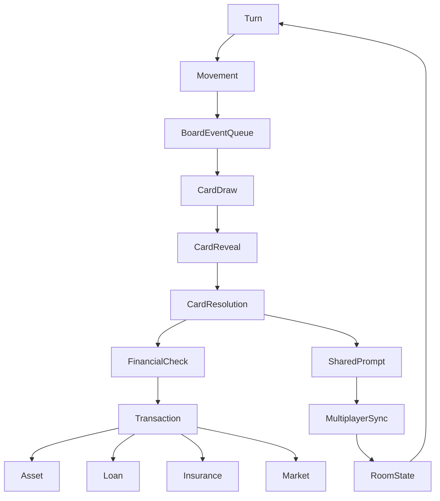

# 第二人生 Current Game System Map

> 本文件是逆向盤點，不是 Architecture Review，不做分數評等。
> 內容只根據目前程式實際存在的函式、state、UI 與 Firestore 寫入點整理。

## 1. Game Overview

目前完整核心循環可拆成以下 15 個階段。每一階段都同時對應到入口函式、核心 state、UI 觸發與 Firestore 寫入。

| 階段 | 入口函式 / 觸發 | 核心 state | 修改 state 的函式 | UI | Firestore 寫入點 | 完成條件 |
|---|---|---|---|---|---|---|
| 建立房間 | `createRoom` / `CoachDashboard` / `CreateRoomModal` | `Room`, `room.boardState`, `room.members` | `createRoom`, `setRoom` | `LobbyView`, `CoachDashboard` | `rooms/{roomId}` | 房間文件建立完成 |
| 玩家加入 | `joinRoom`, `leaveRoom` | `room.members`, `playerStates` | `joinRoom`, `leaveRoom` | `RoomView`, `LobbyView` | `rooms/{roomId}` | 成員與角色同步完成 |
| 遊戲初始化 | `startRoomGame` | `room.status`, `boardState`, `gameState.isSetup` | `startRoomGame`, `setGameState` | `CoachGameView`, `GameView` | `rooms/{roomId}`, `playerStates` | 狀態進入 `playing` |
| 決定順序 | `startRoomGame` 後的 `boardState.turnOrder` | `boardState.currentTurnUid`, `turnOrder` | room 初始化流程 | `GameHeader`, `GameStats` | `rooms/{roomId}.boardState` | 回合順序固定 |
| 玩家回合 | `GameView` 回合控制 | `boardState.currentTurnUid` | `rollBoardDice`, `advanceBoardEventQueue` | `GameView` | `rooms/{roomId}.boardState` | 當前玩家完成全部事件 |
| 擲骰 | `handleBoardDiceRoll` / `rollBoardDice` | `boardState.movement`, `lastRoll` | `rollBoardDice` | `DiceRollContainer`, `DiceRollModal` | `rooms/{roomId}.boardState` | 骰點與路徑建立 |
| 移動 | `moveCurrentPlayerToSquare` / `boardState.movement` | `playerPositions`, `movement` | `moveCurrentPlayerToSquare` | 棋盤、動畫、頭像 | `rooms/{roomId}.boardState` | 角色抵達落點 |
| 經過格事件 | `pass` 流程內的銀行 / 學校 / 維修廠 | `pendingEvents`, `currentEvent` | `advanceBoardEventQueue`, `applyBoardMarketPrices` | `BoardCardDrawer`, `PaydayModal` | `rooms/{roomId}.boardState`, `playerStates` | 經過格事件處理完 |
| 停留格事件 | `land` 流程內卡片 / 醫院 / 銀行 / 學校 / 維修廠 | `currentCard`, `currentEvent`, `currentCardReveal` | `revealBoardCard`, `resolveBoardCardAction` | 卡片 Drawer、各類 Modal | `rooms/{roomId}.boardState` | 停留事件結束 |
| 抽卡 | `drawBoardCard`, `drawPostExamHappinessCard`, `drawBoardFollowupCard` | `deckState`, `currentCard` | `revealBoardCard` | `BoardCardDrawer` | `rooms/{roomId}.boardState.deckState` | 抽到的卡進入可揭示狀態 |
| 卡片處理 | `resolveBoardCardAction` | `currentCard`, `pendingCardAction`, `pendingFamilyMilestoneJoinAction`, `sharedCardPrompt` | `resolveBoardCardAction`, `submitSharedCardPromptResponse`, `submitFamilyMilestoneJoinResponse` | `GameView`, `BoardFinancialCheckModal` | `rooms/{roomId}.boardState`, `playerStates` | 卡片效果全部落帳 |
| 財務檢核 | `BoardFinancialCheckModal`, `handleApplyBoardFinancialCheck` | `TransactionData`, `gameState.cash`, `assets`, `liabilities` | `handleApply...`, `applyResolvedBoardFinancialTx` | 財務檢核 Modal | `playerStates`, `history` | 交易成功寫入 |
| 事件完成 | `finalizeBoardFinancialFlow` / `dismissBoardCard` | `currentEvent`, `pendingEvents` | `advanceBoardEventQueue`, `clear...` | `GameView` | `rooms/{roomId}.boardState` | 事件狀態被清空 |
| 回合結束 / 下一玩家 | `advanceBoardEventQueue` 最後段 | `currentTurnUid`, `skipTurns` | `advanceBoardEventQueue` | `GameView`, `BoardProjectionView` | `rooms/{roomId}.boardState` | 切換到下一位玩家 |

整體來看，現況不是單純「擲骰走格」遊戲，而是：

建立房間 → 玩家加入 → 房間同步 → 回合控制 → 多層事件隊列 → 卡片揭示/結算 → 財務檢核 → 多人同步 → 下一位玩家。

---

## 2. Complete Game System Inventory

以下以「功能責任」分系統整理。這不是理想架構，是目前程式中實際能辨識出的遊戲系統。

### 2.1 Auth / Identity System
- **Purpose**：登入、註冊、角色識別。
- **Core State**：`AuthContext.user`, `user.role`, `user.title`.
- **Entry Functions**：`AuthProvider`, `LoginView`.
- **Mutation Functions**：`signInWithEmailAndPassword`, Google / Apple login, register.
- **UI Components**：`AuthView`, `LoginView`.
- **Data Source**：Firebase Auth, `users` collection.
- **Firestore Dependency**：高。
- **Other Dependencies**：Lobby / Room / Coach / Game.
- **Known Hardcode**：GM 帳號、角色字串。
- **Known Risks**：身份與遊戲角色混雜。
- **Can Reuse If Rebuild**：高。
- **Rebuild Difficulty**：低。

### 2.2 Lobby / Room Management System
- **Purpose**：建立房間、加入房間、房間列表與等待區。
- **Core State**：`Room`, `room.members`, `room.status`.
- **Entry Functions**：`createRoom`, `joinRoom`, `leaveRoom`, `closeRoom`.
- **Mutation Functions**：`setRoom`, `updateDoc`, `startRoomGame`.
- **UI Components**：`LobbyView`, `RoomView`, `CreateRoomModal`.
- **Data Source**：Firestore `rooms`.
- **Dependencies**：Auth、Coach、Multiplayer Sync。
- **Hardcode**：最大人數、Practice room 規則。
- **Risks**：房間狀態與遊戲狀態耦合。
- **Reuse**：高。
- **Rebuild Difficulty**：中。

### 2.3 Coach / Admin System
- **Purpose**：執行師監控、開局、結束、報告、玩家管理。
- **Core State**：`CoachGameView` 狀態、`room.status`, `pendingRequests`.
- **Entry Functions**：`CoachDashboard`, `CoachGameView`.
- **Mutation Functions**：`startRoomGame`, `finishRoomGame`, request approve/reject.
- **UI Components**：`CoachDashboard`, `CoachGameView`, `CoachReportView`.
- **Data Source**：Firestore room / requests / records。
- **Dependencies**：Room、Game、History。
- **Hardcode**：執行師可見的操作路徑。
- **Risks**：主持端與玩家端流程不一致。
- **Reuse**：中高。
- **Rebuild Difficulty**：中。

### 2.4 Game Initialization / Setup System
- **Purpose**：遊戲開始前設定、同步 session、建立初始 board state。
- **Core State**：`gameState.isSetup`, `sessionId`, `boardState`.
- **Entry Functions**：`startRoomGame`, `SelectionView`, `CreateReportView`.
- **Mutation Functions**：`setGameState`, `startRoomGame`.
- **UI Components**：`SelectionView`, `CreateReportView`.
- **Data Source**：localStorage + Firestore。
- **Dependencies**：Auth、Room、Selection。
- **Risks**：初始化與續玩狀態互相污染。
- **Reuse**：中。
- **Rebuild Difficulty**：中。

### 2.5 Turn System
- **Purpose**：控制 current turn、回合順序、skip turn、回合切換。
- **Core State**：`boardState.currentTurnUid`, `skipTurns`, `turnOrder`.
- **Entry Functions**：`rollBoardDice`, `advanceBoardEventQueue`.
- **Mutation Functions**：`advanceBoardEventQueue`, `moveCurrentPlayerToSquare`.
- **UI Components**：`GameHeader`, `GameStats`, `GameView`.
- **Data Source**：`room.boardState`.
- **Dependencies**：Movement、Event Queue、Financial Flow。
- **Hardcode**：skip turn、停回合、事件未完不得切換。
- **Risks**：事件阻塞與動畫阻塞交疊。
- **Reuse**：中高。
- **Rebuild Difficulty**：高。

### 2.6 Dice System
- **Purpose**：一般移動骰、學校骰、醫院骰、家庭歷程骰。
- **Core State**：`lastRoll`, local dice modal state.
- **Entry Functions**：`rollBoardDice`, `handleHospitalRollConfirm`, `handleFamilyJoinRoll`.
- **UI Components**：`DiceRollContainer`, `DiceRollModal`, `DiceFace`.
- **Dependencies**：Turn、Board Event、School、Hospital、Family。
- **Risks**：不同骰型規則散落。
- **Reuse**：高。
- **Rebuild Difficulty**：中。

### 2.7 Movement System
- **Purpose**：路徑計算、經過格 / 停留格、頭像動畫。
- **Core State**：`boardState.movement`, `playerPositions`, `boardPosition`.
- **Entry Functions**：`rollBoardDice`, `moveCurrentPlayerToSquare`.
- **UI Components**：棋盤、頭像、剩餘步數提示。
- **Dependencies**：Board、Turn、Event Queue。
- **Hardcode**：棋盤 52 格、路徑順時針。
- **Risks**：本地動畫與 board state 不一致。
- **Reuse**：高。
- **Rebuild Difficulty**：高。

### 2.8 Board Layout / Square System
- **Purpose**：定義 52 格棋盤、特殊格分布、格子類型。
- **Core State**：`board.ts`, `boardSquares`.
- **Entry Functions**：board 常數初始化。
- **UI Components**：BoardProjectionView、棋盤格渲染。
- **Dependencies**：Movement、Event、Card。
- **Hardcode**：格位與類型固定。
- **Reuse**：高。
- **Rebuild Difficulty**：中。

### 2.9 Board Event Queue System
- **Purpose**：把經過 / 停留 / 連動事件排成可完成的隊列。
- **Core State**：`boardState.pendingEvents`, `currentEvent`, `currentCard`, `currentCardReveal`.
- **Entry Functions**：`advanceBoardEventQueue`.
- **Mutation Functions**：`advanceBoardEventQueue`, `drawBoardFollowupCard`, `drawPostExamHappinessCard`.
- **UI Components**：`BoardCardDrawer`, `GameView`.
- **Dependencies**：Turn、Card、Financial、Bank。
- **Risks**：shared prompt 與隊列可能互卡。
- **Reuse**：中高。
- **Rebuild Difficulty**：高。

### 2.10 Card Draw System
- **Purpose**：從三個牌堆抽卡。
- **Core State**：`deckState`, deck ids in `src/data/cards/*.json`.
- **Entry Functions**：抽卡相關 context 函式。
- **UI Components**：卡片 Drawer、卡片覆蓋層。
- **Dependencies**：Board、Event Queue。
- **Risks**：抽完重洗、卡池順序、重複抽取。
- **Reuse**：高。
- **Rebuild Difficulty**：中。

### 2.11 Card Reveal System
- **Purpose**：把抽到的卡由背面轉成前台可看見。
- **Core State**：`currentCardReveal`.
- **Entry Functions**：`revealBoardCard`, `handleBoardCardReveal`.
- **UI Components**：`BoardCardDrawer`.
- **Dependencies**：Card Draw、Resolution。
- **Risks**：Reveal 與 Resolve 時機混在一起。
- **Reuse**：高。
- **Rebuild Difficulty**：中。

### 2.12 Card Resolution System
- **Purpose**：依卡號 / 類型產生實際效果。
- **Core State**：`BoardCardActionDefinition`, `TransactionData`, `sharedCardPrompt`.
- **Entry Functions**：`resolveBoardCardAction`, `handleApply...`.
- **UI Components**：`BoardFinancialCheckModal`, `GameView`.
- **Dependencies**：Financial、Assets、Insurance、Market、Family。
- **Hardcode**：很多卡號分支仍存在。
- **Risks**：程式與卡片 JSON/文件容易不同步。
- **Reuse**：中。
- **Rebuild Difficulty**：高。

### 2.13 Shared Prompt / Family Milestone System
- **Purpose**：處理多人共同參與卡、家庭歷程、共享回覆。
- **Core State**：`sharedCardPrompt`, `familyMilestoneJoinPrompt`, `pendingFamilyMilestoneJoinAction`.
- **Entry Functions**：`openSharedCardPrompt`, `openFamilyMilestoneJoinPrompt`.
- **Mutation Functions**：`submitSharedCardPromptResponse`, `submitFamilyMilestoneJoinResponse`.
- **UI Components**：`GameView` 內的 shared modal / family modal。
- **Dependencies**：Card、Turn、Multiplayer。
- **Risks**：response、modal 關閉、結果保留時間。
- **Reuse**：中。
- **Rebuild Difficulty**：高。

### 2.14 Financial Summary / Statement System
- **Purpose**：把資產、負債、收入、支出、淨值、現金流顯示出來。
- **Core State**：`gameState.assets`, `liabilities`, `income`, `expenses`, `cash`.
- **Entry Functions**：`calculateFinancialSummary`, `FinancialStatement`.
- **UI Components**：`FinancialStatement`, `GameStats`.
- **Dependencies**：Asset、Loan、Insurance、Business。
- **Risks**：財務彙總與交易明細可能不一致。
- **Reuse**：中高。
- **Rebuild Difficulty**：中。

### 2.15 Transaction / Financial Check System
- **Purpose**：所有交易、扣款、收入、賠付都要走結算與檢核。
- **Core State**：`TransactionData`, `history`, `pending...`。
- **Entry Functions**：`useTransactionLogic`, `BoardFinancialCheckModal`.
- **Mutation Functions**：`applyTransaction`, `handleDeleteTransactionRecord`.
- **UI Components**：`TransactionForm`, `BoardFinancialCheckModal`.
- **Dependencies**：Card、Bank、Asset、Loan、Insurance。
- **Hardcode**：交易型別很多，逆推也很多。
- **Risks**：Undo / 回滾 fragile。
- **Reuse**：中。
- **Rebuild Difficulty**：高。

### 2.16 Bank / Payday / Service Window System
- **Purpose**：月結餘、銀行窗口、定存、保險、借貸入口。
- **Core State**：`bankServiceWindowActive`, `bankServiceGrantedAtEventId`, `pendingRequests`.
- **Entry Functions**：`PaydayModal`, `BankingAppModal`, `WealthView`, `BankingView`.
- **Mutation Functions**：`updateRoomTimer`, `applyBoardExpenseToAllPlayers`, loan / insurance / deposit handlers.
- **Dependencies**：Financial、Loan、Insurance、Deposit。
- **Risks**：入口頁面與權限條件分散。
- **Reuse**：中高。
- **Rebuild Difficulty**：高。

### 2.17 Loan / Liability System
- **Purpose**：信用貸款、房貸、企業貸款、車貸、強制負債。
- **Core State**：`liabilities`, `loans`.
- **Entry Functions**：`BankingView`, `useTransactionLogic`.
- **Mutation Functions**：借款 / 還款 / 自動扣款。
- **Dependencies**：Financial、Bank、Asset。
- **Hardcode**：利率與自動還款規則混雜。
- **Reuse**：中。
- **Rebuild Difficulty**：高。

### 2.18 Insurance System
- **Purpose**：醫療、房屋、汽車保險。
- **Core State**：`medicalInsuranceCount`, asset insurance flags.
- **Entry Functions**：`WealthView`, `MedicalClaimModal`.
- **Mutation Functions**：購買、理賠、月支出更新。
- **Dependencies**：Bank、Asset、Financial Check。
- **Risks**：理賠重複、保險附掛位置不一致。
- **Reuse**：中。
- **Rebuild Difficulty**：高。

### 2.19 Deposit System
- **Purpose**：定存建立、解約、利息。
- **Core State**：`assets` 中的 `定存`.
- **Entry Functions**：`WealthView`, `BankingAppModal`.
- **Mutation Functions**：存入、解約、利息結算。
- **Dependencies**：Bank、Financial。
- **Risks**：窗口權限與可隨時解約的規則不同步。
- **Reuse**：中高。
- **Rebuild Difficulty**：中。

### 2.20 Stock Market / Dividend System
- **Purpose**：股票價格、買賣、股利、行情更新。
- **Core State**：`room.marketPrices`, `gameState.marketPrices`, `previousMarketPrices`.
- **Entry Functions**：`applyBoardMarketPrices`, `BrokerView`, `StockMarketModal`.
- **Mutation Functions**：市場更新、買賣股票、配息。
- **Dependencies**：Financial、Card、Transaction。
- **Hardcode**：價格來源、股利計算、舊資料相容。
- **Risks**：雙來源價格衝突。
- **Reuse**：中。
- **Rebuild Difficulty**：高。

### 2.21 Asset Ownership / Real Estate / Business / Vehicle System
- **Purpose**：資產持有、出售、附掛、升級、用途切換。
- **Core State**：`assets`, `assetDetails`, `gameState.abilities`.
- **Entry Functions**：`useGameLogic`, `TransactionForm`, `BoardCardActions`.
- **Mutation Functions**：買賣房屋、企業、汽車、轉換用途。
- **Dependencies**：Financial、Bank、Card、Loan、Insurance。
- **Hardcode**：名稱判斷、類型推導、保險掛載。
- **Risks**：舊名稱與正式名稱混用。
- **Reuse**：中。
- **Rebuild Difficulty**：高。

### 2.22 Profession / Promotion System
- **Purpose**：職業、等級、薪資、升等、考試。
- **Core State**：`profession`, `currentRankLevel`, `currentRankTitle`, `abilities`.
- **Entry Functions**：`PromotionModal`, `LifelongLearningModal`, `useDiceRollLogic`.
- **Mutation Functions**：升等、加薪、能力變動。
- **Dependencies**：School、Card、Financial。
- **Risks**：升等路徑與學校 / 卡片事件共用。
- **Reuse**：中高。
- **Rebuild Difficulty**：中高。

### 2.23 Happiness / Score / Settlement System
- **Purpose**：幸福值、最終分數、勝利判定、成就。
- **Core State**：`happiness`, `happinessTotal`, `completedHappinessEvents`.
- **Entry Functions**：`calculateScoreResult`, `HappinessWinAnimation`.
- **Mutation Functions**：幸福卡、家庭歷程、得分結算。
- **Dependencies**：Card、Family、Settlement。
- **Risks**：幸福值與最後排名的關係分散。
- **Reuse**：中高。
- **Rebuild Difficulty**：中。

### 2.24 Multiplayer Sync / Persistence System
- **Purpose**：房間同步、playerStates 同步、listener 更新、復歸。
- **Core State**：`room`, `playerStates`, localStorage draft state.
- **Entry Functions**：`RoomProvider`, `GameProvider`.
- **Mutation Functions**：`updateDoc`, `onSnapshot`, debounce sync.
- **Dependencies**：所有 room/game 系統。
- **Risks**：重寫覆蓋、過期 snapshot、斷線恢復。
- **Reuse**：中。
- **Rebuild Difficulty**：高。

### 2.25 Modal / Interaction Orchestration System
- **Purpose**：管理所有 modal、drawer、prompt 的開關、遮罩、阻塞順序。
- **Core State**：`activeBoardCard`, `activeBankPromptKey`, `activeHospitalPromptKey`, `activeSchoolPromptKey`, `pending...`.
- **Entry Functions**：`GameView`, 各種 modal component。
- **Dependencies**：Board、Bank、Card、Financial、Turn。
- **Risks**：多 modal 互卡、關閉條件分散。
- **Reuse**：低中。
- **Rebuild Difficulty**：中高。

### 2.26 History / Reporting / Records System
- **Purpose**：歷史紀錄、報表、結果頁、玩家紀錄。
- **Core State**：`history`, `player_sessions`, report state.
- **Entry Functions**：`HistoryView`, `CoachHistoryView`, `CoachReportView`, `RoomRecordsView`.
- **Dependencies**：Financial、Score、Room。
- **Reuse**：中。
- **Rebuild Difficulty**：中。

### 2.27 Achievement System
- **Purpose**：成就展示與達成條件。
- **Core State**：`constants/achievements.ts`.
- **Entry Functions**：`AchievementsView`.
- **Dependencies**：Score / Settlement。
- **Reuse**：高。
- **Rebuild Difficulty**：低。

### 2.28 Support / Tutorial / Onboarding System
- **Purpose**：新手教學、提示、說明、引導。
- **Core State**：tutorial / banner local state.
- **Entry Functions**：`TutorialModal`, `InstallPromptBanner`.
- **Dependencies**：Auth / Lobby / Game.
- **Reuse**：中。
- **Rebuild Difficulty**：低。

---

## 3. Feature / Screen Inventory

目前主要畫面、Drawer、Modal、Prompt 如下：

| UI 區塊 | Component | Trigger | State dependency | Action | Close condition | Related system |
|---|---|---|---|---|---|---|
| 登入 | `AuthView`, `LoginView` | 未登入 | `AuthContext` | 登入 / 註冊 | auth 完成 | Auth |
| 大廳 | `LobbyView` | 登入後 | `room` 列表 | 建房 / 加房 | 切到房間 | Room |
| 房間等待 | `RoomView` | 加入房間後 | `room.members` | 準備開局 | 開局 / 離開 | Room / Coach |
| 執行師監控 | `CoachGameView` | coach / GM | `room`, `playerStates` | 開局、監控、結束 | room 狀態切換 | Coach |
| 遊戲主畫面 | `GameView` | room playing | board / game / modal state | 回合操作 | 遊戲結束 | Core Game |
| 棋盤投影 | `BoardProjectionView` | `?boardRoom=` | `room.boardState` | 只讀看板 | 離開頁面 | Board |
| 財務報表 | `FinancialStatement` | 玩家點開 | `gameState` | 檢視資產負債 | 關閉 | Financial |
| 現金流紀錄 | `CashFlowLog` | 報表內 | `history` | 檢視交易 | 關閉 | Financial / History |
| 交易表單 | `TransactionForm` | 銀行/交易入口 | `TransactionData` | 買賣、借貸、保險 | 確認/取消 | Transaction |
| 銀行 App | `BankingAppModal` | 銀行入口 | `marketPrices`, `assets`, `liabilities` | 股票/貸款/保險/定存/汽車 | 離開銀行 | Bank |
| 股票頁 | `BrokerView` | Banking App | `marketPrices` | 買賣股票 | 完成交易 | Stock |
| 銀行頁 | `BankingView` | Banking App | `liabilities` | 借款/還款 | 完成交易 | Loan |
| 財富頁 | `WealthView` | Banking App | `assets` | 保險/定存/汽車 | 完成交易 | Insurance / Deposit / Vehicle |
| 財務檢核 | `BoardFinancialCheckModal` | 交易需要檢核 | `TransactionData` | 確認交易 | 檢核通過 | Financial Check |
| 卡片 Drawer | `BoardCardDrawer` | 抽卡 / Reveal | `currentCard`, `currentCardReveal` | 顯示卡片效果 | 結算完成 | Card |
| 幸福卡列表 | `HappinessListModal` | 幸福卡選擇 | `happiness` | 選擇幸福項目 | 選完 | Happiness |
| 醫療理賠 | `MedicalClaimModal` | 醫療事件 | insurance / claim state | 申請理賠 | 申請完成 | Insurance |
| 月結餘 | `PaydayModal` | 經過銀行 | `bankServiceWindowActive` | 顯示月結餘 | 完成 | Bank / Payday |
| 升等 | `PromotionModal` | 學校/升等 | rank / dice state | 考試與升等 | 結束 | Profession / School |
| 終身學習 | `LifelongLearningModal` | 學習卡 / 事件 | `abilities` | 認證能力 | 完成 | Profession |
| 企業升級 | `BizUpgradeModal` | 企業/工作室流程 | business state | 升級 | 完成 | Business |
| 家庭歷程 | `GameView` 內 family modal | family join prompt | `familyMilestoneJoinPrompt` | 擲骰回覆 | 事件完成 | Family |
| 投資輸入 | `BoardFinancialCheckModal` / bank modal | 大型企業投資 | amount state | 輸入投資金額 | 檢核完成 | Financial / Business |
| 排行 / 得分 | `ScoreView`, `LeaderboardModal` | 遊戲結束 | score state | 顯示結果 | 關閉 | Settlement |
| 歷史頁 | `HistoryView`, `CoachHistoryView` | 報告 | records | 查詢歷史 | 離開 | History |
| 成就 | `AchievementsView` | 入口 | achievements | 查看成就 | 關閉 | Achievement |

---

## 4. State Inventory

### Room State
- **Defined at**：`src/context/RoomContext.tsx`, `src/types.ts`
- **Examples**：`room.id`, `room.status`, `room.members`, `room.playerStates`, `room.marketPrices`, `room.previousMarketPrices`, `room.boardState`, `room.pendingRequests`
- **Written by**：`RoomContext`, coach / host actions, board event flows
- **Read by**：`GameView`, `CoachGameView`, `BankingAppModal`, `BoardProjectionView`
- **Persisted**：Firestore `rooms/{roomId}`
- **Source of Truth**：多人同步主要以 `room` 為權威
- **Reset condition**：開新房 / 關房 / 結束遊戲

### Board State
- **Defined at**：`src/types.ts`, `RoomContext`
- **Examples**：`currentTurnUid`, `turnOrder`, `playerPositions`, `skipTurns`, `movement`, `pendingEvents`, `currentCard`, `currentCardReveal`, `currentEvent`, `deckState`, `cardLog`, `familyMilestoneJoinPrompt`, `sharedCardPrompt`
- **Written by**：`rollBoardDice`, `advanceBoardEventQueue`, `revealBoardCard`, shared prompt handlers
- **Read by**：`GameView`, `BoardProjectionView`
- **Persisted**：Firestore `rooms/{roomId}.boardState`
- **Source of Truth**：boardState
- **Reset condition**：開新局 / 結束房間

### Player State
- **Defined at**：`src/types.ts`, `GameContext`
- **Examples**：`cash`, `assets`, `liabilities`, `income`, `expenses`, `happiness`, `happinessTotal`, `marketPrices`, `bankServiceWindowActive`, `pendingFamilyMilestoneJoinAction`, `pendingStartupUpgradeAction`
- **Written by**：`GameContext`, `useGameLogic`, `useTransactionLogic`, board financial flows
- **Read by**：`FinancialStatement`, `BankingAppModal`, `GameView`
- **Persisted**：localStorage + Firestore `room.playerStates`
- **Source of Truth**：本機 `gameState` 與 room.playerStates 雙向同步，實際上是雙來源
- **Reset condition**：重建遊戲 / 清掉 session

### Game State
- **Defined at**：`GameContext`
- **Examples**：`profession`, `selectedEnterprise`, `selectedDream`, `currentRankTitle`, `currentRankLevel`, `completedHappinessEvents`, `history`, `sessionId`
- **Written by**：`setGameState`, `useGameLogic`
- **Read by**：幾乎所有玩家 UI
- **Persisted**：localStorage + Firestore sync
- **Source of Truth**：本機為主，房間同步為副本
- **Reset condition**：登入切換 / 重開 session

### UI State
- **Defined at**：`GameView`, `App.tsx`, modal components
- **Examples**：各 modal open/close、tab key、drawer 展開、動畫中 flag、按鈕 disable
- **Written by**：React component state
- **Read by**：對應 UI
- **Persisted**：否
- **Source of Truth**：本地 UI
- **Reset condition**：離開畫面 / modal close

### Pending State
- **Defined at**：`GameView`, `RoomContext`
- **Examples**：`pendingCardAction`, `pendingRequests`, `pendingBoardStepAdvance`, `pendingBoardLifelongRoll`, `pendingForcedBoardPayment`
- **Written by**：事件 / 交易流程
- **Read by**：對應 modal / handler
- **Persisted**：部分在 room，部分只在本地
- **Source of Truth**：混合
- **Reset condition**：事件完成 / 清除 prompt

### Derived State
- **Defined at**：`useMemo` / helper functions / component derived values
- **Examples**：`summary = calculateFinancialSummary(gameState)`, `scoreResult`, `effectiveMarketPrices`, `canUseBankProducts`, `isBoardTurn`
- **Written by**：計算函式
- **Read by**：UI / handlers
- **Persisted**：否
- **Source of Truth**：不可當作正式資料
- **Reset condition**：state 變動即重算

### Firebase Persisted State
- **Defined at**：`rooms`, `users`, `player_sessions`
- **Examples**：`room.playerStates`, `room.boardState`, `room.marketPrices`, `pendingRequests`, `player_sessions`
- **Written by**：`RoomContext`, `GameContext`, coach flows
- **Read by**：room listeners / auth / history / reports
- **Source of Truth**：房間同步層
- **重點衝突**：
  - `marketPrices` 同時存在於 room 與 gameState
  - `bankServiceWindowActive` 同時出現在 room/playerState 與 local state
  - `boardPosition` / `skipTurns` 同時出現在 player / board state
  - `sharedCardPrompt` / `familyMilestoneJoinPrompt` 同時存在於 room 與本地 snapshot

---

## 5. Complete Card System Map

### Happiness Cards
- **類型分群**
  - `H001-H010`：幸福回憶卡 / 故事分享型
  - `H011-H020`, `H043-H046`：家庭重要歷程
  - `H021-H042`：消費、生活、親子、情境型幸福卡
- **Resolver**：`resolveBoardCardAction` 的 happiness 分支
- **Required State**：`happiness`, `expenses`, `children`, family milestone stage
- **Player Interaction**：分享故事、接受/拒絕、多人參與
- **Financial Effect**：一次性支出、月支出、幸福點、孩子數
- **Shared / Local**：部分本地、部分共享
- **Completion Rule**：故事分享或歷程 / 選擇完成後結束
- **Hardcode**：卡號對應支出分類與階段邏輯
- **JSON Support**：`happiness.cards.json`
- **Rebuild Recommendation**：資料化很高，但家庭歷程仍需專門狀態機

### Opportunity Cards
- **類型分群**
  - `C001-C008`：終身學習 / 能力提升
  - `C009-C026`：房屋 / 店面求購卡
  - `C027-C034`：企業 / 工作室收購卡
  - `C035-C037`：醫療卡
  - `C038`：汽車被偷
  - `C039-C040`：車禍 / 車損
  - `C041-C043`：房屋修繕
  - `C045-C048`：通貨膨脹
  - `C051-C053`：後續抽卡
  - `C054`：資源回收
  - `C055`：奉獻所得
  - `C056-C058`：創業貸款 / 兼職工作室
- **Resolver**：`resolveBoardCardAction` 的 opportunity 分支
- **Required State**：資產、保險、能力、學校、銀行、貸款
- **Player Interaction**：選擇接受 / 不接受 / 輸入金額 / 共享回覆
- **Financial Effect**：現金、月支出、貸款、資產、幸福
- **Shared / Local**：多數是 shared prompt + 財務檢核
- **Completion Rule**：交易 / 無效果 / 共享回覆完成
- **Hardcode**：大量卡號分支與條件判斷
- **JSON Support**：`opportunity.cards.json`
- **Rebuild Recommendation**：中高，適合抽成 resolver registry

### News Cards
- **類型分群**
  - `N001-N026`：股價新聞
  - `N027-N028`：股利 / 股息
  - `N029-N046`：房市新聞
  - `N047-N054`：店面 / 小型企業新聞
  - `N055`：大型企業投資
  - `N056-N058`：創業貸款
- **Resolver**：`resolveBoardCardAction` 的 news 分支
- **Required State**：`room.marketPrices`, `gameState.marketPrices`, stocks, assets, liabilities
- **Player Interaction**：買入 / 賣出 / 放棄 / 輸入金額 / 接受貸款
- **Financial Effect**：價格更新、配息、資產購買、貸款、月收入 / 月支出
- **Shared / Local**：股價新聞與股利常見為多人共享；房市 / 店面 / 貸款常為共享或分流流程
- **Completion Rule**：市場同步、持股結算、交易完成
- **Hardcode**：部分新聞卡仍以特定股號表格處理
- **JSON Support**：`news.cards.json`
- **Rebuild Recommendation**：中高，必須先統一價格來源

---

## 6. Financial Domain Map

| 財務概念 | State Field / 資料來源 | 計算函式 / 流程 | Transaction 入口 | UI 顯示 | 關聯卡片 | 已知重複邏輯 |
|---|---|---|---|---|---|---|
| 現金 | `gameState.cash` | `calculateFinancialSummary` | 各種交易 | 報表、銀行、財務檢核 | 幾乎全部 | 多處直接改 cash |
| 收入 | `income` | 月結餘、報表統計 | 薪資 / 租金 / 企業收入 | 財務報表 | 幸福、新聞、企業 | 多處手動加減 |
| 支出 | `expenses` | 月結餘、報表統計 | 保險 / 定存 / 生活支出 | 財務報表 | 幸福、醫療、通膨 | 分類邏輯分散 |
| 月現金流 | `income - expense` | 報表計算 | Payday / 銀行 | 報表、月結餘 | 銀行、財務檢核 | 同公式多處重算 |
| 資產 | `assets` | 財務報表 / 持倉檢查 | buy/sell/convert | 報表、銀行 | 股票、房屋、企業、車、定存 | 資產類型命名不一 |
| 負債 | `liabilities`, `loans` | 報表、還款、月扣 | borrow / repay | 報表、銀行 | 所有貸款卡 | `liabilities` / `loans` 雙來源 |
| 保險 | 資產附掛 / 獨立 count | 月支出 + 理賠 | 醫療 / 房屋 / 汽車保險 | 銀行、醫療理賠 | 醫療、車禍、房修 | 附掛位置散 |
| 股票 | 股票資產 + `marketPrices` | 市值計算 | 買賣 / 配息 / 股價變動 | 銀行、報表 | 新聞卡、股利卡 | `room.marketPrices` / `gameState.marketPrices` |
| 房屋 | `assets` + assetDetails | 自住 / 出租 / 估值 | 購買 / 轉換 / 修繕 | 銀行、報表 | 房市新聞、修繕卡 | 名稱與類型推導 |
| 企業 | `assets` + monthly income | 收購 / 升級 / 現金流 | 購買 / 升級 / 投資 | 報表、銀行 | 企業卡、投資卡 | 成本與收益多分支 |
| 汽車 | `assets` + loan | 移動骰加成 | 購買 / 理賠 / 被偷 | 銀行、卡片 | 車禍 / 車損 / 被偷 | 舊名稱「飛行器」仍存在 |
| 財務檢核 | `BoardFinancialCheckModal` | 檢核交易是否成立 | 所有正式交易 | 檢核 Modal | 幾乎全部 | 成功後落帳與顯示分散 |
| 強制負債 | `liabilities` 特例 | 現金不足時生成 | 強制付款卡 / 事件 | 報表、銀行 | 財務檢核、卡片事件 | 與一般貸款邏輯不同 |

目前最重複的財務計算集中在：
- 月現金流
- 股票價格 / 市值
- 貸款利息與還款
- 保險月支出與理賠
- 資產買賣金額與財務檢核

---

## 7. Multiplayer Flow Map

目前多人流程大致如下：

`Player UI` → `Handler` → `RoomContext / GameLogic` → `Firestore` → `Snapshot listener` → `Other players UI`

### 典型路徑
1. 玩家在 `GameView` / `BankingAppModal` / 各種 Modal 點擊操作。
2. handler 先改本地 UI state。
3. `RoomContext` 或 `GameContext` 寫入 `rooms/{roomId}` 或 `playerStates`。
4. Firestore snapshot 更新其他人。
5. 其他玩家從 listener 重算畫面與派生 state。

### 目前存在的同步風險
- **simultaneous write risk**：多人同時改同一個 room 文件。
- **overwrite risk**：`room.boardState`、`marketPrices`、`pendingRequests` 同文件競寫。
- **duplicated action risk**：本地 UI 與 snapshot 同步延遲時，可能重送一次操作。
- **stale state risk**：舊 snapshot 仍在 local state 內使用。
- **disconnect blocking risk**：pending prompt、turn lock、shared response 被中途斷線卡住。

### 目前可見的同步保護
- `executeWithLock` / 類似防重入流程
- current turn / current event gate
- shared prompt completion gate
- board movement settle delay

但這些保護偏前端與流程層，還不是強一致後端保證。

---

## 8. System Dependency Map

目前真實依賴關係可簡化成：

### 依賴強度摘要
- **LOW**：Achievement、Tutorial、部分報表
- **MEDIUM**：Auth、Lobby、History、Selection、Coach
- **HIGH**：Turn、Board、Card、Financial、Bank、Asset、Market、Multiplayer
- **CROSS-LAYER**：Card 直接打到 Financial / Asset / Loan / Insurance；RoomContext 同時管狀態與流程

---

## 9. Reusable Assets

### Direct Reuse
- `src/data/cards/*.json`
- `src/constants/board.ts`
- `src/constants/achievements.ts`
- 大部分 UI 元件外觀與版型
- Firebase 專案設定與登入流程

### Reuse After Adapter
- `RoomContext.tsx`
- `GameContext.tsx`
- `GameView.tsx`
- `boardCardActions.ts`
- `BankingAppModal.tsx`
- `FinancialStatement.tsx`
- `useTransactionLogic.ts`

### Rule Reference Only
- `docs/spec/PRODUCT_SPECIFICATION.md`
- `docs/gdd/*.md`
- `docs/decision/*.md`
- `docs/rfc/*.md`

### Do Not Reuse
- `src/constants/cards.ts.new`
- 依字串硬編的反推撤銷邏輯
- 舊名稱混用的資產 / 負債判斷字串
- 任何會把 `room.marketPrices` 與 `gameState.marketPrices` 當雙主權的邏輯

---

## 10. Rebuild Module List

以下是如果重新製作，實際要拆出的模組。這不是理想架構，是從現況倒推的最小可行切分。

1. **Game Core**
   - Responsibility：回合、擲骰、移動、事件、卡片、財務結算核心規則
   - Existing Source：`GameView`, `RoomContext`, `boardCardActions`
   - Dependencies：Board / Card / Financial / Turn
   - Can Reuse：部分邏輯與資料
   - Must Rebuild：事件狀態機、共享 prompt 流程

2. **Room / Multiplayer**
   - Responsibility：房間、加入、同步、snapshot
   - Existing Source：`RoomContext`, `LobbyView`, `RoomView`
   - Dependencies：Auth、Game Core
   - Can Reuse：UI 外殼與部分 API
   - Must Rebuild：同步資料邊界

3. **Player / Identity**
   - Responsibility：登入、角色、玩家資料
   - Existing Source：`AuthContext`, `GameContext`
   - Can Reuse：登入流程
   - Must Rebuild：狀態分層

4. **Board / Movement**
   - Responsibility：棋盤格、路徑、經過 / 停留
   - Existing Source：`board.ts`, movement helpers
   - Can Reuse：格位資料
   - Must Rebuild：事件與動畫分離

5. **Card Engine**
   - Responsibility：抽卡、揭示、結算、follow-up
   - Existing Source：`boardCardActions`, `cards.ts`
   - Can Reuse：卡池 JSON
   - Must Rebuild：resolver registry

6. **Financial Engine**
   - Responsibility：交易、檢核、現金流、結算
   - Existing Source：`useTransactionLogic`, `FinancialStatement`
   - Can Reuse：部分計算公式
   - Must Rebuild：交易正規化與回滾

7. **Banking**
   - Responsibility：銀行頁、貸款、保險、定存、汽車
   - Existing Source：`BankingAppModal`, `BankingView`, `BrokerView`, `WealthView`
   - Can Reuse：大部分 UI
   - Must Rebuild：權限與入口控制

8. **Assets**
   - Responsibility：股票、房屋、企業、車、定存附掛
   - Existing Source：`assetLabels.ts`, transaction handlers
   - Can Reuse：分類資料
   - Must Rebuild：統一 ownership model

9. **Market**
   - Responsibility：股票行情、股利、房市、企業市場
   - Existing Source：room marketPrices / news cards
   - Can Reuse：價格表資料
   - Must Rebuild：單一權威價格來源

10. **Profession / Career**
    - Responsibility：職業、升等、考試
    - Existing Source：`PromotionModal`, `LifelongLearningModal`
    - Can Reuse：UI 與部分事件
    - Must Rebuild：流程清晰化

11. **Happiness / Settlement**
    - Responsibility：幸福值、分數、勝利判定
    - Existing Source：`calculateScoreResult`, `HappinessWinAnimation`
    - Can Reuse：大部分計分 UI
    - Must Rebuild：規則邏輯整理

12. **History / Reporting**
    - Responsibility：紀錄、報表、結算畫面
    - Existing Source：`HistoryView`, `CoachReportView`
    - Can Reuse：查詢頁
    - Must Rebuild：資料模型整合

13. **Support UI**
    - Responsibility：教學、提示、安裝提示
    - Existing Source：各 modal/banner
    - Can Reuse：高
    - Must Rebuild：低

---

## 11. Rebuild Scope Matrix

以下以文字分級替代數字評分：

| System | Current Implementation | 重用判斷 | 重建判斷 | Complexity | Dependency Risk |
|---|---|---|---|---|---|
| Room / Multiplayer | 已有但耦合重 | 中 | 高 | 高 | 高 |
| Turn | 已存在 | 中 | 高 | 高 | 高 |
| Board / Movement | 已存在 | 高 | 中 | 高 | 高 |
| Card Engine | 已存在但分支多 | 中 | 高 | 高 | 高 |
| Financial Engine | 已存在但計算分散 | 中 | 高 | 高 | 高 |
| Bank / Loans / Insurance | 已有 UI 與流程 | 中高 | 高 | 高 | 中高 |
| Stock Market | 已有資料與部分流程 | 中 | 高 | 高 | 高 |
| Assets | 已有資料與分類 | 中 | 高 | 高 | 高 |
| Profession | 已有功能 | 中高 | 中 | 中高 | 中 |
| Happiness / Settlement | 已有功能 | 高 | 中 | 中 | 中 |
| History / Reports | 已有功能 | 高 | 低中 | 中 | 中 |
| Support UI | 大多可保留 | 高 | 低 | 低 | 低 |

判斷依據：
- 若系統已經有穩定 UI 與資料，只是規則耦合重，則「重用判斷」較高、但「重建判斷」也高，代表可以保留外殼但核心要重做。
- 若系統只是展示層，通常可直接重用。

---

## 12. Final Rebuild Assessment

### 1. 如果完全重寫，需要重做多少個核心 System？
以目前盤點，至少要重做 12 個核心模組，才足以承接完整玩法；若把銀行、卡片、財務、多人同步拆開，實際會接近 20 個子系統。

### 2. 哪些 System 最複雜？
最複雜的前 10 個是：
1. Room / Multiplayer
2. Turn
3. Board / Movement
4. Board Event Queue
5. Card Resolution
6. Financial Engine
7. Bank / Loans / Insurance
8. Stock Market
9. Asset Ownership
10. Shared Prompt / Family Milestone

### 3. 哪些 System 可以直接搬？
- 卡片 JSON
- 棋盤格位資料
- 成就資料
- 大部分 UI 外觀元件
- 登入與基本房間外殼
- 報表與歷史頁面

### 4. 哪些 System 是目前最大的技術債？
- 單一 room 文件塞過多狀態
- `room.marketPrices` / `gameState.marketPrices` 雙來源
- `liabilities` / `loans` 雙來源
- 卡片 resolver 的大量硬編分支
- shared prompt / family prompt 與 UI 關閉條件耦合
- undo / 回滾靠字串反推

### 5. 如果只重寫 Game Core，需要搬哪些模組？
- Board / Movement
- Turn
- Card Engine
- Financial Engine
- Bank / Loans / Insurance
- Asset / Market
- Shared Prompt / Family
- Profession / Happiness

### 6. 如果完整重寫，最合理的實作順序是什麼？
1. 資料模型與房間同步邊界
2. Turn / Board / Movement
3. Card Engine
4. Financial Engine
5. Bank / Loan / Insurance
6. Asset / Market
7. Profession / Happiness / Settlement
8. 報表、歷史、成就
9. UI 細修與教學

### 7. 依目前專案實際規模，完整重寫是否真的比繼續修 Bug 快？
不是。  
如果目標是「短期可玩、快速穩定」，繼續修 Bug 與局部模組化更快。  
如果目標是「長期可維護、規則可擴充」，則 **重寫 Game Core（保留 UI / Firebase）** 會比全面重做更務實。  
整體來看，**不建議直接走完整重製 D**；比較合理的是 **B 或 C**。

### A / B / C / D 四方案比較

| 方案 | 做法 | 優點 | 缺點 | 結論 |
|---|---|---|---|---|
| A | 原架構繼續 Hotfix | 最快上線 | 技術債持續累積、同步風險不解 | 不建議 |
| B | 原架構逐步模組化 | 成本比重寫低、風險可分批 | 仍要忍受舊結構一段時間 | 可行，適合保守路線 |
| C | 重寫 Game Core，保留 UI / Firebase | 能解掉核心耦合，又不浪費現有畫面與後台 | 需要較完整的規劃與工程時間 | **最平衡，最推薦** |
| D | 完整重新製作 | 最乾淨、最自由 | 成本最高、風險最大、上線最慢 | 只適合產品全面改版 |

### 最終建議
如果目標是「評估是否值得重做」，這個專案 **值得重做核心，但不值得整包重來**。  
最務實的路線是：
- 保留 UI、Firebase、卡片資料、部分報表頁
- 重寫 Game Core / Card Engine / Financial Engine / Multiplayer Sync
- 先把最重的耦合點拆掉，再決定是否要繼續擴大範圍

---

## Quick Summary

- 實際找到的 Game Systems：**28 個**
- 最複雜的 10 個 Systems：Turn、Board、Movement、Board Event Queue、Card Resolution、Financial Engine、Bank / Loan / Insurance、Stock Market、Asset Ownership、Shared Prompt / Family Milestone
- 可以直接重用的項目：卡片 JSON、棋盤資料、成就資料、UI 外殼、登入與報表頁
- 必須重寫的項目：核心狀態邊界、事件隊列、卡片 resolver、財務引擎、多人同步邊界
- 四方案比較：**C 最平衡，B 次之，A 與 D 都不理想**
- 最終建議：**重做核心，不整包重做**
