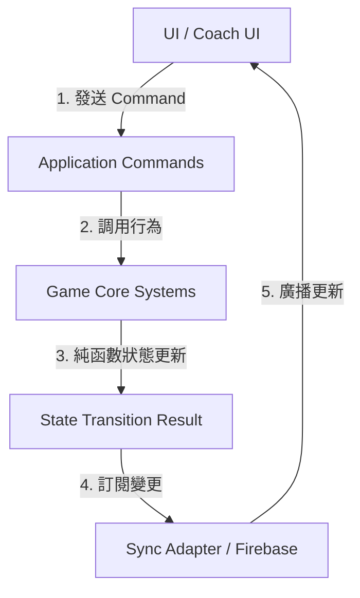

# Game System Map

本文件根據 [GAME_OVERVIEW.md](file:///Users/wcg/程式開發/蜂富人生HappinessFlow/.worktrees/線上模式0611/docs/rewrite/GAME_OVERVIEW.md) 與 [LEGACY_SYSTEM_INVENTORY.md](file:///Users/wcg/程式開發/蜂富人生HappinessFlow/.worktrees/線上模式0611/docs/rewrite/LEGACY_SYSTEM_INVENTORY.md)，以模組化軟體架構（Modular Software Architecture）與高內聚、低耦合原則，定義新版《第二人生》的系統架構與地圖。

---

## 1. 系統分類 (System Classification)

為實現 Headless Game Core（無頭遊戲核心）設計，系統被明確劃分為以下四類：

### A. Headless Game Core (無頭遊戲核心系統)
純粹的記憶體與規則引擎，不依賴任何外部框架或 UI 繪製。所有狀態變更均為確定性的（Deterministic）。
- **Game Core**、**Player**、**Turn**、**Dice**、**Board**、**Movement**、**Event Queue**、**Card**、**Shared Event**、**Financial**、**Asset**、**Liability / Loan**、**Insurance**、**Stock / Market**、**Bank**、**School**、**Hospital**、**Repair**、**Happiness**、**Family Milestone**、**Profession**、**Business**、**Real Estate**、**Settlement**。

### B. UI (使用者介面系統)
僅負責繪製與渲染，並透過 Command 發送給 Game Core。不應包含任何遊戲規則與計算邏輯。
- **UI Views** (如報表元件、地圖渲染、彈窗管理)、**Coach (執行師控制台介面)**。

### C. Sync / Infrastructure (同步與基礎設施系統)
負責資料持久化、房間連線與多人狀態廣播，屬於適配器層（Adapter）。
- **Match / Room**、**Sync Adapter (Firebase Sync)**。

### D. Data / Config (靜態資料與配置)
純靜態設定檔，不可包含執行期狀態。
- **Card Decks (卡池 JSON)**、**Board Config (52格棋盤定義)**、**Profession/Dream/RealEstate/Business Presets**。

---

## 2. 依賴方向 (Dependency Direction)

為避免循環依賴並確保遊戲核心可測試性，架構採用嚴格的單向依賴流（Unidirectional Dependency Flow）：

1. **UI / Coach UI**：發送指令（Commands），例如 `RollDiceCommand`、`PurchaseAssetCommand`。
2. **Application Commands**：充當邊界入口（Controller），負責驗證 Command 與尋找對應的 Core 系統。
3. **Game Core Systems**：核心領域服務。在記憶體中完成計算，擁有純函數性質。
4. **State Transition Result**：輸出變更差額與事件（Event/State Delta）。
5. **Sync Adapter / Firebase**：監聽到 State Transition 後，發送給資料庫做寫入與多人同步，最後以 Snapshot 形式流回 UI。

---

## 3. 系統細節對照表 (System Details)

---

### 1. Game Core
- **分類**：Headless Game Core
- **Responsibility**：作為全域協調器，統一接收 Command，分發給各子系統，並輸出變更結果。
- **Owns**：`GameState` (整個賽局與各玩家狀態的聚合根 Aggregate Root)。
- **Does Not Own**：Firebase 連線、本地 UI Render 流程。
- **State Owned**：全域賽局運行狀態（如 `status`、`elapsedTime`、`turnIndex`）。
- **Rules Owned**：賽局必須在初始化後才能輪流回合。
- **Inputs**：`StartMatchCommand`, `ApplyTickCommand`
- **Outputs**：`StateTransitionResult`
- **Side Effects**：無。
- **Source of Truth**：記憶體中的賽局聚合狀態。
- **Dependencies**：所有 Core 子系統。
- **Public Interface**：`execute(command: Command): StateTransitionResult`
- **Reuse From Legacy**：無（舊版無全域 Game Core 核心，僅分散的 Context）。
- **Do Not Copy From Legacy**：禁止讓 UI 直接操作 `RoomContext` 的 React State。

---

### 2. Match / Room
- **分類**：Sync / Infrastructure
- **Responsibility**：處理多人房間連線、房號建立、房間成員管理與計時器。
- **Owns**：`RoomMember`, `RoomTimer`
- **Does Not Own**：玩家個人財務狀態、棋盤移動邏輯。
- **State Owned**：`roomId`, `members`, `roomStatus` (waiting, playing, finished), `timerSec`
- **Rules Owned**：非房間成員不可加入遊戲，Host 退出時進行房權轉移。
- **Inputs**：`CreateRoomCommand`, `JoinRoomCommand`, `StartTimerCommand`, `PauseTimerCommand`
- **Outputs**：`RoomSyncEvent`
- **Side Effects**：寫入 Firestore `rooms` 集合。
- **Source of Truth**：Firestore `rooms` 文件。
- **Dependencies**：無。
- **Public Interface**：`createRoom()`, `joinRoom(roomId, user)`, `startTimer()`, `pauseTimer()`
- **Reuse From Legacy**：Firebase 連線與房號生成邏輯。
- **Do Not Copy From Legacy**：不要將高頻的 Event Queue 與個人 GameState 全部塞入單一 Room 文件，應分散儲存。

---

### 3. Player
- **分類**：Headless Game Core
- **Responsibility**：定義與管理玩家本體、名字、頭像與當前離線狀態。
- **Owns**：`PlayerProfile`
- **Does Not Own**：玩家的財務報表（歸 Financial 管轄）。
- **State Owned**：`uid`, `name`, `avatar`, `isOnline`
- **Rules Owned**：無。
- **Inputs**：`RegisterPlayerCommand`, `SetOnlineStatusCommand`
- **Outputs**：`PlayerUpdatedEvent`
- **Side Effects**：無。
- **Source of Truth**：Game State 中的 Player 屬性。
- **Dependencies**：無。
- **Public Interface**：`getPlayerProfile(uid)`
- **Reuse From Legacy**：玩家基本型別定義。
- **Do Not Copy From Legacy**：不要在 Player 模組中混入財務變更邏輯。

---

### 4. Turn
- **分類**：Headless Game Core
- **Responsibility**：管理回合順序、當先前回合持有者、停回合（Skip Turns）邏輯。
- **Owns**：`TurnOrder`, `SkipTurnTracker`
- **Does Not Own**：擲骰邏輯與格子觸發。
- **State Owned**：`currentTurnUid`, `orderList`, `skipTurnsMap` (UID -> count)
- **Rules Owned**：只有當前回合玩家可擲骰；若被停回合，輪到時扣減 `skipTurns` 並立即輪空切換。
- **Inputs**：`NextTurnCommand`, `ApplySkipTurnCommand`
- **Outputs**：`TurnSwitchedEvent`, `SkipTurnDecrementedEvent`
- **Side Effects**：自動觸發 Event Queue 的 Turn Start 事件。
- **Source of Truth**：Game State 內的 Turn 狀態。
- **Dependencies**：Event Queue
- **Public Interface**：`nextTurn(): string`, `addSkipTurn(uid, rounds)`
- **Reuse From Legacy**：`getNextTurnUid` 計算邏輯。
- **Do Not Copy From Legacy**：將 `skipTurns` 同時記錄在個人 `gameState` 與全域 `boardState` 的雙重同步邏輯。

---

### 5. Dice
- **分類**：Headless Game Core
- **Responsibility**：提供隨機或確定性的骰點生成（支援測試與開發者 Debug 模式）。
- **Owns**：無。
- **Does Not Own**：棋盤移動。
- **State Owned**：無（無狀態模組）。
- **Rules Owned**：每顆骰子的點數範圍為 1~6。
- **Inputs**：`RollDiceCommand` (包含骰子數量與 Debug 點數覆寫選項)
- **Outputs**：`DiceRolledResult` (包含點數、各骰明細)
- **Side Effects**：無。
- **Source of Truth**：無。
- **Dependencies**：無。
- **Public Interface**：`roll(count: number, forceValue?: number): number[]`
- **Reuse From Legacy**：Debug 模式強限制骰點的設計。
- **Do Not Copy From Legacy**：直接在 `RoomContext` 內聯呼叫 `Math.random()` 的做法，難以單元測試。

---

### 6. Board
- **分類**：Data / Config 與 Headless Game Core
- **Responsibility**：管理 52 格棋盤的靜態格子配置、落點計算、路徑推導。
- **Owns**：`BoardGridMap`
- **Does Not Own**：玩家目前實際位置。
- **State Owned**：無。
- **Rules Owned**：棋盤 Index 範圍為 0~51，超過自動取模循環。
- **Inputs**：`GetPathCommand`
- **Outputs**：`PassedSquaresList`
- **Side Effects**：無。
- **Source of Truth**：靜態 `boardConfig.json`。
- **Dependencies**：無。
- **Public Interface**：`getPassedAndLandingSquares(from: number, roll: number): { passed: Square[], landing: Square }`
- **Reuse From Legacy**：52格棋盤的格子順序與類型定義。
- **Do Not Copy From Legacy**：硬編碼格子名稱或在 UI 直接寫死 Index 邏輯。

---

### 7. Movement
- **分類**：Headless Game Core
- **Responsibility**：處理角色擲骰後的移動事件生成。
- **Owns**：`MovementState`
- **Does Not Own**：前端的棋子移動動畫。
- **State Owned**：`currentMovePath`, `isMoving`
- **Rules Owned**：沒有汽車時強制只能使用 1 顆骰，有汽車時可選擇 1 顆或 2 顆骰。
- **Inputs**：`MovePlayerCommand`
- **Outputs**：`MovementResolvedEvent` (含經過與落點列表)
- **Side Effects**：在 Event Queue 中新增經過事件與停留事件。
- **Source of Truth**：`boardState.movement`
- **Dependencies**：Dice, Board, Turn, Asset, Event Queue
- **Public Interface**：`resolveMovement(uid: string, diceCount: number)`
- **Reuse From Legacy**：有車可選兩骰的規則。
- **Do Not Copy From Legacy**：利用 `setTimeout` 遞延狀態 settled 的不安全寫法，應由前端動畫播放完畢後發送 Completed Command。

---

### 8. Board Event Queue
- **分類**：Headless Game Core
- **Responsibility**：管理事件佇列（經過、停留、後續 follow-up），確保流程依序被核決。
- **Owns**：`EventQueue`
- **Does Not Own**：各事件的具體財務計算或卡片效果結算。
- **State Owned**：`pendingEvents` (事件佇列陣列), `currentEvent` (當前處理中事件)
- **Rules Owned**：佇列中若有事件，或當前事件未完成，禁止進入 `EndTurn` 或切換下一位。
- **Inputs**：`PushEventCommand`, `ResolveCurrentEventCommand`
- **Outputs**：`EventTriggeredEvent`, `QueueClearedEvent`
- **Side Effects**：切換回合。
- **Source of Truth**：`boardState.pendingEvents`
- **Dependencies**：Turn
- **Public Interface**：`push(event: BoardEvent)`, `resolveCurrent()`, `isEmpty(): boolean`
- **Reuse From Legacy**：經過格優先於停留格處理的設計。
- **Do Not Copy From Legacy**：在推進 Queue 時混入 `alert()` 以及混亂的 UI flags 清理。

---

### 9. Card
- **分類**：Headless Game Core & Data / Config
- **Responsibility**：管理三個牌堆（幸福、機運、新聞），處理洗牌、抽卡、 Reveal 與 Resolve 階段。
- **Owns**：`ActiveDeck`, `UsedDeck`
- **Does Not Own**：卡片效果引發的財務檢核 UI 阻擋。
- **State Owned**：`decks` (各牌堆的隨機序列)
- **Rules Owned**：Revealed 之前卡片不得生效。牌堆抽乾後，將 Used 重新打亂並推回 Active。
- **Inputs**：`DrawCardCommand`, `RevealCardCommand`, `ResolveCardCommand`
- **Outputs**：`CardDrawnEvent`, `CardEffectResolvedEvent`
- **Side Effects**：可能產生財務變更、狀態變更或 Follow-up 事件。
- **Source of Truth**：三份 JSON 檔案 + 記憶體中的剩餘牌堆。
- **Dependencies**：Event Queue, Financial, Happiness
- **Public Interface**：`drawCard(deckType: string): Card`, `resolveCard(cardId: string, playerUid: string)`
- **Reuse From Legacy**：已清洗修正的 `src/data/cards/*.json` 資料庫。
- **Do Not Copy From Legacy**：在 `boardCardActions.ts` 內手動用 if/else 實作與 JSON 欄位高度重複的卡片效果判定。

---

### 10. Shared Event
- **分類**：Headless Game Core
- **Responsibility**：協調多人共享事件（如家庭歷程共同參與、通膨、全員收購、股利發放）的回覆收集。
- **Owns**：`SharedPrompt`
- **Does Not Own**：個別玩家決定後產生的財務檢核。
- **State Owned**：`activePrompts` (含 `id`, `cardId`, `targetPlayerUids`, `responses: Record<string, Response>`)
- **Rules Owned**：必須等待所有 Target 玩家提交回覆後，該 Shared Event 才能從佇列中 Resolved。
- **Inputs**：`CreateSharedPromptCommand`, `SubmitResponseCommand`
- **Outputs**：`PromptCompletedEvent`, `ResponseSubmittedEvent`
- **Side Effects**：觸發所有受影響玩家的財務與資產變更。
- **Source of Truth**：`boardState.sharedCardPrompt`
- **Dependencies**：Event Queue, Financial, Player
- **Public Interface**：`createPrompt(...)`, `submitResponse(promptId, playerUid, response)`
- **Reuse From Legacy**：`Prompt` 的資料 Schema 與響應模型。
- **Do Not Copy From Legacy**：UI 端用本地 State 另外維護一份 snapshot 和已回覆陣列，導致與雲端狀態不同步的設計。

---

### 11. Financial
- **分類**：Headless Game Core
- **Responsibility**：作為財務核心引擎（Transaction Kernel），進行現金、月收支計算並執行 Payday。
- **Owns**：`Ledger` (財務流水帳)
- **Does Not Own**：個別資產（Asset）的細節邏輯。
- **State Owned**：`cashMap` (UID -> number)
- **Rules Owned**：任何交易不得導致玩家結算後為負現金；Payday 會強制將月收入加到現金中，並減去月支出。
- **Inputs**：`ApplyTransactionCommand`, `ExecutePaydayCommand`
- **Outputs**：`TransactionCompletedEvent`, `PaydayResolvedEvent`
- **Side Effects**：可能因負現金觸發破產或強制清償。
- **Source of Truth**：`gameState.cash` + 現金流流水帳。
- **Dependencies**：Asset, Liability / Loan, Insurance
- **Public Interface**：`calculateSummary(uid): FinancialSummary`, `applyTx(uid, tx: Transaction)`
- **Reuse From Legacy**：財務安全、寬裕與自由的計算公式。
- **Do Not Copy From Legacy**：沒有單一財務交易核心，導致利息、保費在多個 React 元件各自寫公式重算的設計。

---

### 12. Asset
- **分類**：Headless Game Core
- **Responsibility**：管理所有持有的資產（定存、股票、不動產、企業、汽車），執行增加與銷毀。
- **Owns**：`PlayerAssets`
- **Does Not Own**：股票的當前行情。
- **State Owned**：`assetsMap` (UID -> Asset[])
- **Rules Owned**：玩家購買資產必須扣除現金；定存有最低開戶金額；汽車最多只能持有一部。
- **Inputs**：`AddAssetCommand`, `RemoveAssetCommand`, `UpgradeAssetCommand`
- **Outputs**：`AssetAddedEvent`, `AssetRemovedEvent`
- **Side Effects**：改變玩家的被動收入與幸福狀態。
- **Source of Truth**：`gameState.assets`
- **Dependencies**：Financial, Happiness
- **Public Interface**：`addAsset(uid, asset)`, `removeAsset(uid, assetId)`
- **Reuse From Legacy**：`Asset` 介面的屬性欄位。
- **Do Not Copy From Legacy**：以 `name.includes("單間小套房")` 這種模糊字串匹配來判斷資產種類的設計。

---

### 13. Liability / Loan
- **分類**：Headless Game Core
- **Responsibility**：管理所有負債（信用貸款、房貸、企業貸、車貸、強制負債），計算每月利息。
- **Owns**：`PlayerLiabilities`
- **Does Not Own**：定存與資產增值。
- **State Owned**：`liabilitiesMap` (UID -> Liability[])
- **Rules Owned**：利息規則：信用貸款 `10%`、強制負債 `0%`、其餘 `0.5%`；還款必須一次還清該筆項目。
- **Inputs**：`CreateLoanCommand`, `RepayLoanCommand`
- **Outputs**：`LoanCreatedEvent`, `LoanRepaidEvent`
- **Side Effects**：改變每月利息支出、扣除或增加現金。
- **Source of Truth**：`gameState.liabilities`（新版廢除舊版 redundant 的 `loans` 欄位）。
- **Dependencies**：Financial
- **Public Interface**：`createLoan(uid, type, amount)`, `repayLoan(uid, liabilityId)`
- **Reuse From Legacy**：各類型貸款的預設月利率。
- **Do Not Copy From Legacy**：讓 `liabilities` 陣列與單獨的 `loans` 數字欄位同時並存於狀態中。

---

### 14. Insurance
- **分類**：Headless Game Core
- **Responsibility**：購買保險，並在醫療、車損、房修事件發生時自動抵免維修費。
- **Owns**：`PlayerInsurances`
- **Does Not Own**：資產的外牆維修等損壞實體。
- **State Owned**：`medicalInsuranceCountMap` (UID -> count), `assetInsurance`
- **Rules Owned**：保險費用統一為每月 2,000H；醫療保險可堆疊次數，每次理賠扣減 1 次；房屋與汽車保險掛載於資產，隨資產轉讓或銷毀。
- **Inputs**：`BuyInsuranceCommand`, `ClaimInsuranceCommand`
- **Outputs**：`InsurancePurchasedEvent`, `ClaimApprovedEvent`
- **Side Effects**：扣除保費支出、在財務檢核中自動抵免對應現金扣除。
- **Source of Truth**：`medicalInsuranceCount` + `asset.isInsured`
- **Dependencies**：Financial, Asset
- **Public Interface**：`buyInsurance(uid, insuranceType, assetId?)`, `checkAndConsumeInsurance(uid, riskType, assetId?)`
- **Reuse From Legacy**：醫療保險計次與汽車/房屋保險掛載資產的設計。
- **Do Not Copy From Legacy**：保險抵扣邏輯零散分佈在 `boardCardActions.ts` 與各 Modal UI 內的設計。

---

### 15. Stock / Market
- **分類**：Headless Game Core
- **Responsibility**：維護全賽局統一的股票行情（A10-B80），並處理拆股/合併/股利股息結算。
- **Owns**：`MarketQuotes`
- **Does Not Own**：玩家手持股票數量（由 Asset 管轄）。
- **State Owned**：`currentQuotes` (Symbol -> Price), `previousQuotes`
- **Rules Owned**：股價更新需廣播給所有人；股利卡觸發時，符合持股玩家依股票張數發放股利。
- **Inputs**：`UpdateQuotesCommand`, `DistributeDividendCommand`
- **Outputs**：`QuotesUpdatedEvent`, `DividendDistributedEvent`
- **Side Effects**：改變受影響玩家的現金或股票持股張數（股息）。
- **Source of Truth**：`boardState.marketPrices` (新版確立此為唯一權威價格來源)。
- **Dependencies**：Asset, Financial
- **Public Interface**：`getQuote(symbol): number`, `updateQuotes(newQuotes)`, `applyDividend(symbol, amountPerShare, isStock)`
- **Reuse From Legacy**：八支股票代號（A10~B80）與初始行情波動設定。
- **Do Not Copy From Legacy**：Room 與 Player 本地 `gameState` 同時各自儲存 `marketPrices` 的雙頭行情設計。

---

### 16. Bank
- **分類**：Headless Game Core
- **Responsibility**：處理銀行「經過事件」與「停留事件」，提供限時視窗（Window）與常駐金融服務的切分。
- **Owns**：無。
- **Does Not Own**：個別的借款與還款細節（由 Financial / Loan 處理）。
- **State Owned**：`bankWindowActiveMap` (UID -> boolean)
- **Rules Owned**：經過銀行必觸發 Payday。經過後開啟銀行服務視窗，玩家可在該視窗開啟期間辦理定存、保險與大額還款。
- **Inputs**：`TriggerBankEventCommand`, `CloseBankWindowCommand`
- **Outputs**：`BankEventResolvedEvent`, `BankWindowClosedEvent`
- **Side Effects**：發放月結餘，時間到自動關閉窗口。
- **Source of Truth**：`boardState.currentEvent` (銀行經過) + 當前視窗開啟狀態。
- **Dependencies**：Financial, Event Queue
- **Public Interface**：`processBankPassing(uid)`, `openBankWindow(uid)`, `closeBankWindow(uid)`
- **Reuse From Legacy**：經過銀行觸發 Payday 並短暫開啟服務視窗的邏輯。
- **Do Not Copy From Legacy**：將銀行經過事件與定存/保險的操作 UI 權限條件綁定在不透明的 state flags 上。

---

### 17. School
- **分類**：Headless Game Core
- **Responsibility**：處理學校經過/停留事件，決定考試資格，並在考試後發送 Follow-up 抽幸福卡。
- **Owns**：無。
- **Does Not Own**：職涯等級本身（由 Profession 管轄）。
- **State Owned**：無。
- **Rules Owned**：經過或停留學校均可報名考試（職業晉升、股票能力、不動產能力）；不論考試成功與否，完成考試後均產生一張 Follow-up 抽幸福卡。
- **Inputs**：`RegisterExamCommand`, `ExecuteExamCommand`
- **Outputs**：`ExamResultEvent`
- **Side Effects**：提升職涯等級或解鎖投資屬性，並在 Event Queue 中加入 Follow-up 抽卡。
- **Source of Truth**：`boardState.currentEvent`
- **Dependencies**：Profession, Event Queue, Dice
- **Public Interface**：`registerExam(uid, examType)`, `executeExam(uid, diceRoll)`
- **Reuse From Legacy**：三種考試類型與晉升要求（擲骰點數大於等於特定值）。
- **Do Not Copy From Legacy**：考試後追加抽幸福卡的邏輯被寫死在 React `GameView` 裡，應作為 Follow-up 事件由 Core 派發。

---

### 18. Hospital
- **分類**：Headless Game Core
- **Responsibility**：處理醫院停留事件，計算醫療費與設定停回合。
- **Owns**：無。
- **Does Not Own**：醫療保險理賠（由 Insurance 管轄）。
- **State Owned**：無.
- **Rules Owned**：停留醫院者，須擲骰子支付點數 × 1,000H 的維修/醫療費，並強制停賽 1 回合。若持有醫療保險則免付醫療費（保險次數 -1）。
- **Inputs**：`TriggerHospitalCommand`
- **Outputs**：`HospitalResolvedEvent`
- **Side Effects**：扣除醫療費現金、添加停回合標記。
- **Source of Truth**：`boardState.currentEvent`
- **Dependencies**：Dice, Financial, Insurance, Turn
- **Public Interface**：`resolveHospital(uid, diceRoll)`
- **Reuse From Legacy**：擲骰 × 1,000 醫療費與停回合的規則。
- **Do Not Copy From Legacy**：無。

---

### 19. Repair
- **分類**：Headless Game Core
- **Responsibility**：處理維修廠經過與停留事件，判斷是否擁有汽車並扣除保養費。
- **Owns**：無。
- **Does Not Own**：汽車資產管理。
- **State Owned**：無。
- **Rules Owned**：沒有汽車時，維修廠事件自動無效。有汽車時，經過維修廠須支付點數 × 2,000H 保養費；停留維修廠須支付保養費且停賽 1 回合。汽車保險不抵免保養費。
- **Inputs**：`TriggerRepairCommand`
- **Outputs**：`RepairResolvedEvent`
- **Side Effects**：扣除保養費、添加停回合標記。
- **Source of Truth**：`boardState.currentEvent`
- **Dependencies**：Asset, Dice, Financial, Turn
- **Public Interface**：`resolveRepair(uid, diceRoll, isLanding)`
- **Reuse From Legacy**：有車保養費與停回合邏輯。
- **Do Not Copy From Legacy**：無。

---

### 20. Happiness
- **分類**：Headless Game Core
- **Responsibility**：累加與變更幸福值，追蹤已完成的幸福項目，判斷是否達到 100 分里程碑。
- **Owns**：`CompletedHappinessList`
- **Does Not Own**：幸福家庭重要歷程的加入回覆（由 Family Milestone 管轄）。
- **State Owned**：`happinessPointsMap` (UID -> number), `completedItemIds`
- **Rules Owned**：幸福值累加，達 100 分發送里程碑事件，但不直接終止遊戲。
- **Inputs**：`AddHappinessPointsCommand`, `CompleteHappinessItemCommand`
- **Outputs**：`HappinessUpdatedEvent`, `HappinessMilestoneReachedEvent`
- **Side Effects**：無。
- **Source of Truth**：`gameState.happiness`
- **Dependencies**：無。
- **Public Interface**：`addPoints(uid, points, sourceId?)`, `completeItem(uid, itemId)`
- **Reuse From Legacy**：幸福項目的 ID 與基本點數設定。
- **Do Not Copy From Legacy**：由 UI 的 Checkbox 選中狀態來反推與控制玩家正式幸福點數的危險設計。

---

### 21. Family Milestone
- **分類**：Headless Game Core
- **Responsibility**：依順序推進幸福家庭歷程，控制孩子數量，並處理多人共同參與機制。
- **Owns**：`FamilyState`
- **Does Not Own**：幸福值總分計算（由 Happiness 管轄）。
- **State Owned**：`currentStage` (1.第一次約會 -> 2.求婚 -> 3.婚禮 -> 4.老大 -> 5.老二), `childrenCount`
- **Rules Owned**：家庭歷程必須依序進行，不得跳過；生子（階段4和5）每月多增加 10,000H 撫養費；其他玩家共同參與時，須擲骰大於等於 4 才可加入並取得幸福。
- **Inputs**：`AdvanceFamilyStageCommand`, `JoinFamilyEventCommand`
- **Outputs**：`FamilyStageAdvancedEvent`, `FamilyJoinResolvedEvent`
- **Side Effects**：增加月支出、增加幸福值、建立多人 Shared Prompt。
- **Source of Truth**：`gameState.familyMilestone`
- **Dependencies**：Financial, Happiness, Shared Event
- **Public Interface**：`advanceStage(uid)`, `resolveOtherPlayerJoin(uid, joinerUid, diceRoll)`
- **Reuse From Legacy**：浪漫婚禮、第一個孩子（月支出+10,000H）、第二個孩子（月支出+10,000H）的階段公式。
- **Do Not Copy From Legacy**：將家庭歷程狀態零散記錄在 `completedHappinessEvents` 陣列中，以字串匹配推導。

---

### 22. Profession
- **分類**：Headless Game Core
- **Responsibility**：管理職業初始資料與職級晉升，影響薪資與稅務支出。
- **Owns**：`ProfessionState`
- **Does Not Own**：學校考試事件（由 School 管轄）。
- **State Owned**：`professionId`, `rankLevel` (1~N), `salary`, `tax`
- **Rules Owned**：職級升級會解鎖新的薪資並自動提高所得稅（或職等費）支出。
- **Inputs**：`ChooseProfessionCommand`, `PromoteRankCommand`
- **Outputs**：`ProfessionChosenEvent`, `RankPromotedEvent`
- **Side Effects**：重新計算玩家月收入的 Salary 與月支出的 Tax。
- **Source of Truth**：`gameState.profession` + `gameState.rank`
- **Dependencies**：Financial
- **Public Interface**：`promote(uid)`
- **Reuse From Legacy**：職業初始資料 presets（機師、醫師、科技新貴等之薪資與稅額）。
- **Do Not Copy From Legacy**：升級時將 `salary` 與 `rank` 在多處變更，導致狀態不同步。

---

### 23. Business
- **分類**：Headless Game Core
- **Responsibility**：管理玩家的企業與店面資產，處理企業升級、投資合夥與月收益。
- **Owns**：無。
- **Does Not Own**：企業貸款（由 Loan 處理）。
- **State Owned**：無（由 Asset 與 Financial 統合管轄企業類型的子屬性）。
- **Rules Owned**：創業貸款後，若經過銀行擲骰子大於等於 5，兼職工作室無條件升級為小型企業，取消貸款與利息，並獲得 10,000 倍點數的企業收入。
- **Inputs**：`UpgradeBusinessCommand`, `CompleteStartupLoanUpgradeCommand`
- **Outputs**：`BusinessUpgradedEvent`
- **Side Effects**：大幅增加被動收入、取消企業負債。
- **Source of Truth**：`gameState.assets` 內的企業屬性。
- **Dependencies**：Asset, Financial, Loan
- **Public Interface**：`upgradeBusiness(uid, assetId)`, `resolveStartupUpgrade(uid, assetId, diceRoll)`
- **Reuse From Legacy**：創業貸款（N056-N058）的銀行解鎖與 10,000 倍收入的遊戲機制。
- **Do Not Copy From Legacy**：將企業投資分支成完全不相干的混亂代碼流程，應抽象統一為 Asset 與 Financial 屬性變更。

---

### 24. Real Estate
- **分類**：Headless Game Core
- **Responsibility**：管理不動產資產，計算自住與出租的租金/房貸利息，處理自住與出租的轉換。
- **Owns**：無。
- **Does Not Own**：房貸負債。
- **State Owned**：無（由 Asset / Financial 統合管轄不動產類型的子屬性）。
- **Rules Owned**：房屋自住：租金收入為 0，獲得該房屋設定的幸福點；房屋出租：取得該房屋的租金被動收入，不獲得幸福點；自住/出租可在銀行窗口期間自由轉換。
- **Inputs**：`ToggleRealEstateUseCommand`
- **Outputs**：`RealEstateUseToggledEvent`
- **Side Effects**：改變被動收入與幸福點數。
- **Source of Truth**：`gameState.assets` 內的不動產屬性。
- **Dependencies**：Asset, Financial, Happiness
- **Public Interface**：`toggleUse(uid, assetId, isSelfUse)`
- **Reuse From Legacy**：自住增加幸福點、出租獲得月租金的設定（如兩室一廳、三室兩廳）。
- **Do Not Copy From Legacy**：直接在 UI 中實作自住轉換，卻沒有將轉換後的租金與幸福變更提交回核心結算。

---

### 25. Coach
- **分類**：UI / Sync (此處指 Facilitator UI 及其下發控制指令的接口)
- **Responsibility**：提供執行師/教練控場工具，控制房間時間、手動更新股市、審核玩家提交的特殊請求。
- **Owns**：`CoachSession`
- **Does Not Own**：遊戲的回合順序（執行師不屬於玩家列表）。
- **State Owned**：`timerStatus`, `facilitatorPreferences`
- **Rules Owned**：執行師不佔用回合，可在任何時間發送暫停或結束賽局指令。
- **Inputs**：`HostPauseGameCommand`, `HostUpdateMarketCommand`, `HostResolveRequestCommand`
- **Outputs**：`GamePausedEvent`, `MarketForcedUpdatedEvent`, `RequestResolvedEvent`
- **Side Effects**：影響全體玩家的遊戲時間、股價或事件完成。
- **Source of Truth**：`room` 內的 facilitator 權限。
- **Dependencies**：Room, Stock / Market, Game Core
- **Public Interface**：`pauseGame()`, `forceUpdateStock(symbol, price)`, `approvePlayerRequest(requestId)`
- **Reuse From Legacy**：執行師看板畫面佈局與即時同步概念。
- **Do Not Copy From Legacy**：允許執行師介面直接以暴力寫入方式篡改玩家 gameState，所有操作應走 Core Commands。

---

### 26. Settlement
- **分類**：Headless Game Core
- **Responsibility**：遊戲結束時統計玩家得分，評估里程碑完成度並輸出終局排名。
- **Owns**：無。
- **Does Not Own**：存檔資料庫寫入。
- **State Owned**：無。
- **Rules Owned**：結算公式：最終排名完全依據幸福值排序；若幸福值相同，則依淨值高低排序。財務安全、財務寬裕與財務自由僅作為榮譽里程碑列出。
- **Inputs**：`ExecuteMatchSettlementCommand`
- **Outputs**：`FinalScoreboard` (含玩家名次、得分細節與解鎖里程碑)
- **Side Effects**：將房間狀態設為 `finished`。
- **Source of Truth**：全體玩家的最終 `gameState` 聚合。
- **Dependencies**：Financial, Happiness
- **Public Interface**：`settle(playerStates: GameState[]): FinalScoreboard`
- **Reuse From Legacy**：計分公式與里程碑的段位定義。
- **Do Not Copy From Legacy**：在前端 React Component 內自行寫迴圈排序玩家並決定勝利者的設計。

---

## 4. 第一階段 MVP Game Core 必做系統

若要快速重寫出一個可獨立運作、可測試的 MVP（最小可行性無頭核心），以下為**必做核心系統清單**：

1. **Game Core (賽局核心)**：負責接收 Commands 並推進全域狀態的 Kernel。
2. **Player & Turn (玩家與回合)**：支援玩家初始化、依序輪流回合，以及基本輪空（Skip Turns）。
3. **Dice & Board & Movement (地圖移動)**：52格棋盤路徑計算、經過/停留判定。
4. **Board Event Queue (事件佇列)**：依序阻擋與推進「經過學校/經過銀行/經過維修廠」與「落點卡片格」之流程。
5. **Financial & Asset & Liability (財務三支柱)**：支援現金、月結餘、買賣資產與建立貸款。
6. **Bank (經過Payday)**：經過銀行格自動發放月結餘的基本 Payday 事件。
7. **Card (基本卡片抽牌與 Resolve)**：支援幸福卡、機運卡抽取，以及 Reveal 流程（不需實作全部 160 張效果，先實作基本消費與能力考試即可）。
