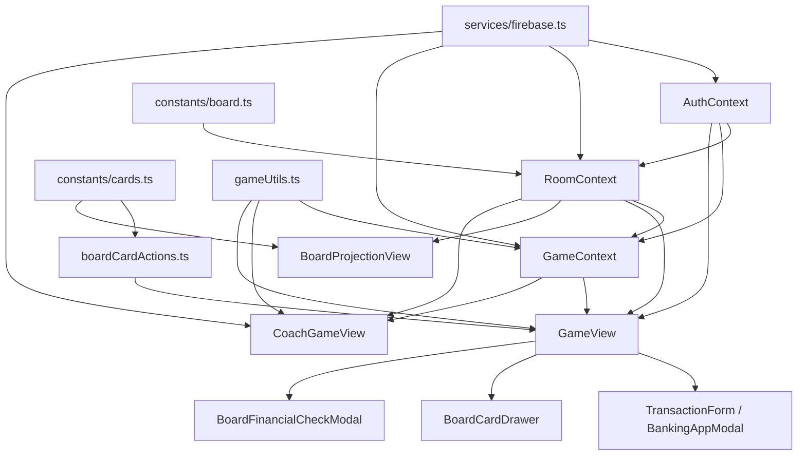

# Architecture RFC

> 分析基準：`docs/PROJECT_OVERVIEW.md`、`docs/STATE_INVENTORY.md`、`docs/STATE_MACHINE.md`、既有 GDD，以及目前 worktree 原始碼，2026-07-02。
>
> 本文件是系統架構盤點文件，不是正式 GDD，不重新設計架構，也不提出重構方案。只描述目前程式真正如何運作。

## 1. Overall Architecture

### Current Implementation

專案是單一 Vite + React + TypeScript 前端，沒有自建後端 API，也沒有 Socket server。多人同步完全依賴 Firebase Auth、Firestore 與 Storage。

整體採用下列分層：

| Layer | 主要位置 | 目前責任 |
|---|---|---|
| UI Layer | `src/views/`、`src/components/` | 畫面組裝、互動、Modal、表單 |
| Business Layer | `src/hooks/`、`src/utils/`、`src/constants/` | 交易規則、財務計算、卡片解析、棋盤規則、靜態資料 |
| State Layer | `src/context/`、元件 `useState` | Auth、Room、Game 與本地 UI state |
| Data Layer | `services/firebase.ts`、Firestore collections | 驗證、即時同步、雲端持久化、頭像上傳 |

啟動路徑為：

```text
App
  -> AuthProvider
    -> RoomProvider
      -> GameProvider
        -> AppContent
          -> currentView 決定顯示哪個 View
```

`src/App.tsx` 沒有使用 React Router。主流程由 `currentView` 本地 state 切換。只有 `?boardRoom=` 會直接進入大地圖投影模式。

### Problem

- 單一前端同時承擔玩家、執行師、管理員與投影端，邏輯邊界主要靠 view 與 role 判斷，不是嚴格模組隔離。
- Room、Board、Event、Financial、Player state 大量集中在 Firestore `rooms/{roomId}` 單一文件。
- 規則層分散在 Hook、Context、Utils、View effect 與 Modal submit handler，中樞不唯一。
- 路由不是 URL-based，狀態恢復、分享與深連結能力有限。

### Recommendation

目前可以保留：

- `AuthProvider -> RoomProvider -> GameProvider` 的三層大結構
- Firestore snapshot 作為多人同步主幹
- `views` / `components` / `context` / `hooks` / `utils` 的基本分層

應列為後續 Architecture GDD / 技術決策議題：

- Room document 是否繼續作為多人遊戲單一聚合根
- GameState 與 playerStates 的正式權威關係
- Event orchestration 是否維持 Context + UI effect 混合模式
- URL routing 是否仍採純本地 view state

## 2. Folder Structure

### Current Implementation

| 路徑 | 用途 |
|---|---|
| `src/views` | 頁級畫面，包含登入、大廳、選角、玩家遊戲、投影、歷史、報表 |
| `src/components` | 可重用 UI 與流程元件，依 banking / business / game / board / modals / transaction / common 分組 |
| `src/context` | `AuthContext`、`RoomContext`、`GameContext` 與 `useX` 入口 |
| `src/hooks` | `useGameLogic`、`useTransactionLogic`、`useDiceRollLogic` |
| `src/utils` | 財務計算、卡片解析、家庭歷程、顯示格式、公用工具 |
| `src/constants` | 棋盤、卡片、版本、成就等靜態資料 |
| `src/types.ts` | 共用型別：資產、負債、棋盤、卡片、交易、GameState 等 |
| `services` | Firebase 初始化、Gemini 報告服務、File utility |
| `docs` | Overview、State、RFC、GDD |
| `scripts` | 測試帳號、資料修補腳本 |

### Problem

- `services`、`utils`、`hooks` 都承載部分業務邏輯，責任邊界不完全清楚。
- `src/constants/cards.ts.new` 顯示 worktree 內仍有並行資料檔，容易造成來源混淆。
- 多數重要 domain 型別集中在 `src/types.ts`，規模持續放大。

### Recommendation

目前資料夾結構可支撐文件化；後續應把「正式責任邊界」納入 Architecture GDD，而不是先推動檔案搬移。

## 3. Context Architecture

### Current Implementation

#### `AuthContext`

- 負責 Firebase Auth 登入、註冊、Google/Apple 第三方登入、登出
- 讀寫 `users/{uid}` 文件
- 管理 `user` 與 `isLoadingAuth`
- 暴露 `login`、`register`、`bindReferral`、`updateUserProfile`、`uploadAvatar`、`logout`

#### `RoomContext`

- 是多人與棋盤共享狀態中樞
- 持有 `room`、`playerStates`、`isLoadingRoom`、`error`
- 對 `rooms/{roomId}` 建立即時監聽
- 負責建房、加房、離房、開始、結束、關房
- 負責 market update、timer update、pendingRequests
- 負責 board event API：
  - `rollBoardDice`
  - `revealBoardCard`
  - `dismissBoardCard`
  - `advanceBoardEventQueue`
  - `drawPostExamHappinessCard`
  - `drawBoardFollowupCard`
  - `openFamilyMilestoneJoinPrompt`
  - `submitFamilyMilestoneJoinResponse`
  - `clearPendingFamilyMilestoneJoinAction`
  - `applyBoardExpenseToAllPlayers`
  - `moveCurrentPlayerToSquare`
  - `applyBoardMarketPrices`
  - `abandonRealEstateCard`
  - `buyRealEstateFromMarket`

#### `GameContext`

- 持有單一玩家 `gameState`
- 計算 `summary`、`scoreResult`
- 管理 `gameHistory`
- 管理本地 `alertInfo`
- 同步 localStorage `happiness_game_state`
- 同步 `rooms/{roomId}.playerStates.{uid}`
- 備份 `player_sessions/{uid}/records/{sessionId}`
- 監聽 `score_records` 與 `player_sessions`

### Provider 相依順序

```text
AuthProvider
  -> RoomProvider (依賴 auth user)
    -> GameProvider (依賴 auth user + room)
```

### Problem

- `RoomContext` 責任過大，同時承擔房間、回合、事件佇列、行情、Timer、Request、Board movement。
- `GameContext` 同時做 state container、autosave、room sync、summary derivation、alert system。
- `GameProvider` 依賴 `RoomProvider`，`GameView` 又同時跨用 Game/Room/Auth 三者，流程容易變成隱性耦合。

### Recommendation

可保留三個 Context 的主題劃分，但目前 `RoomContext` 與 `GameContext` 的實際邊界應列入未來 Architecture GDD。

## 4. Hooks Architecture

### Current Implementation

#### `useGameLogic`

- 目前是玩家端主要交易與規則落帳層
- 依賴 `useGame`
- 負責：
  - 一般交易寫入 `gameState`
  - Payday / 保險理賠 / 升職 / 終身學習
  - 幸福項目增刪
  - 醫療與汽車理賠
  - 企業升級
  - 結算與存檔輔助

#### `useTransactionLogic`

- 目前是交易表單流程引擎
- 管理 phase、mode、assetType 與大量輸入欄位
- 產生 `TransactionData`
- 建立預期的 `AccountEntry[]` 供財務檢核使用
- 本質上是 UI state + domain mapping 混合層

#### `useDiceRollLogic`

- 負責一般考試 / 升等類擲骰動畫
- 管理 `isRolling`、`diceValue`、`examResult`、`examLog`
- 不處理棋盤 movement；棋盤骰屬於 `RoomContext` + `GameView`

### 呼叫關係

```text
GameView
  -> useGameLogic
  -> TransactionForm
     -> BankingAppModal
        -> BrokerView / BankingView / WealthView
           -> onTransaction
  -> DiceRollContainer
     -> useDiceRollLogic
```

### Problem

- `useGameLogic` 很接近 application service，但又直接操作 UI alert 與本地 state。
- `useTransactionLogic` 與 `BankingAppModal` / `TransactionForm` 的邊界疊加，實際交易入口不只一條。
- 棋盤流程大量不在 Hook 內，而是直接寫在 `GameView` effect 與 handler。

### Recommendation

目前 Hook 架構可繼續作為「玩家端規則入口」的觀察基準；但哪些邏輯屬於 Hook、哪些屬於 Context、哪些屬於 View orchestration，應列為未來正式架構議題。

## 5. State Architecture

### Current Implementation

目前 state 可分成六類：

| 類型 | 主要位置 | 實際例子 |
|---|---|---|
| React local state | View / Component / Hook | `currentView`、`show*Modal`、表單輸入、財務檢核選項 |
| Context state | `AuthContext`、`RoomContext`、`GameContext` | `user`、`room`、`playerStates`、`gameState` |
| Firestore state | `rooms/*`、`users/*`、`player_sessions/*` 等 | `boardState`、`marketPrices`、`pendingRequests`、正式紀錄 |
| Local persistent state | browser localStorage | `happiness_game_state`、`active_room_{uid}`、教學/開發者旗標 |
| Temporary flow state | `GameView` 大量 `useState` | `boardFinancialAction`、`pendingForcedBoardPayment`、`pendingBoardStepAdvance` |
| Derived state | `useMemo` / utility | `summary`、`scoreResult`、`pendingRequest`、家庭歷程 status |

### Source of Truth 現況

| 資料 | 目前權威來源 |
|---|---|
| 認證 | Firebase Auth |
| 使用者設定 | `users/{uid}` |
| 房間共享狀態 | `rooms/{roomId}` |
| 玩家當下本地操作 | `GameContext.gameState` |
| 房內玩家同步版 | `rooms/{roomId}.playerStates.{uid}` |
| 投影與執行師顯示 | `room` snapshot + `playerStates` mirror |
| 財務摘要 | `calculateFinancialSummary(gameState)` 衍生值 |

### Problem

- `gameState` 與 `room.playerStates[uid]` 為雙份玩家狀態。
- `room.marketPrices` 與 `gameState.marketPrices` 為雙份行情。
- board event 的共享狀態在 room，但 board financial action / forced payment 卻在 `GameView` 本地。
- 一些本來偏 UI 的旗標被存進 `GameState`，例如 `hasShownWinAnimation`。

### Recommendation

目前可以明確保留「共享 state 在 room、本地玩家 state 在 gameState、本地流程 state 在 view」這個三層觀察模型；但正式 Source of Truth 邊界仍需後續文件確認。

## 6. Firestore Architecture

### Current Implementation

主要資料集合如下：

| Collection / Doc | 用途 |
|---|---|
| `users/{uid}` | 使用者資料、頭像、title、role、invite code |
| `rooms/{roomId}` | 房間、成員、playerStates、marketPrices、pendingRequests、boardState |
| `player_sessions/{uid}/records/{sessionId}` | 玩家草稿 / 自動存檔 |
| `score_records/S1/records/{recordId}` | 正式結算紀錄 |
| `coach_records/{recordId}` | 執行師報表 / 帶局紀錄 |
| `friendships/{id}` | 好友邀請與好友狀態 |
| `audit_logs/{id}` | 稽核紀錄，程式有提到但寫入仍偏保留 |

### 同步方式

- `onSnapshot`
  - `rooms/{roomId}`
  - `score_records`
  - `player_sessions`
  - `friendships`
- `updateDoc`
  - 大部分 room/player state 更新
- `setDoc`
  - 建房、正式紀錄、玩家 session、部分 profile/room 初始化
- `getDoc` / `getDocs`
  - 加入房間前檢查、查歷史、查報表、查 profile
- `deleteDoc`
  - 關房、刪紀錄、刪好友

目前未見集中使用 Firestore transaction / writeBatch 作為主要多人一致性機制。

### 資料流方向

```text
Client Action
  -> updateDoc / setDoc
  -> Firestore
  -> onSnapshot
  -> RoomContext / GameContext / specific View
  -> UI rerender
```

### Problem

- `rooms/{roomId}` 承載共享資料過多，是系統關鍵聚合點。
- 多數更新是「讀 snapshot -> 在 client 組新物件 -> updateDoc」，容易出現最後寫入覆蓋。
- 沒有 socket / authoritative server，事件公平性與併發一致性主要靠客戶端 guard。

### Recommendation

Firestore 即時同步主幹目前明確且一致，可保留作為正式多人同步基礎；但單一 room document 的責任範圍與正式權威欄位，應成為後續 Architecture GDD 討論核心。

## 7. Data Flow

### Current Implementation

#### 玩家交易主流

```text
UI (BankingAppModal / TransactionForm / GameView action)
  -> TransactionData
  -> Financial Check UI
  -> useGameLogic.handleTransactionSubmit()
  -> setGameState()
  -> GameContext autosync -> rooms.playerStates.{uid}
  -> Firestore snapshot
  -> 執行師 / 投影 / 其他玩家 UI 更新
```

#### 棋盤事件主流

```text
GameActions / roll button
  -> RoomContext.rollBoardDice()
  -> boardState.lastRoll + movement
  -> snapshot
  -> RoomContext/GameView/BoardProjectionView 播放 movement
  -> movement resolution
  -> currentEvent / pendingEvents / currentCard
  -> GameView 本地流程處理
  -> advanceBoardEventQueue() / dismissBoardCard()
```

#### 身分與大廳主流

```text
Auth action
  -> Firebase Auth
  -> AuthContext user
  -> App view gating
  -> Lobby / Room / Selection / Game
```

### Problem

- 棋盤 shared flow 與本地 financial flow 混在 `GameView`。
- 交易完成的正式點不只在一個地方，而是 UI 驗證 + hook 套用 + GameContext 同步三段式。
- Score/History/CoachReport 也各自讀寫 Firestore，沒有獨立 application service。

### Recommendation

目前資料流可用「UI -> context/hook -> Firestore -> snapshot -> UI」描述；正式規格應把每條主流程的完成點與權威寫入點定義清楚。

## 8. UI Flow

### Current Implementation

主要 UI 流程如下：

| Flow | 主要經過元件 |
|---|---|
| 登入 | `AuthView` -> `LoginView` -> `AuthContext` |
| 大廳 | `LobbyView` -> `RoomView` / `CreateRoomModal` / `ProfileModal` / `FriendsModal` |
| 建房 / 加房 | `LobbyView` -> `RoomContext.createRoom/joinRoom` |
| 開始遊戲 | `App` -> `CreateReportView` -> `SelectionView` -> `GameView` |
| 玩家遊戲 | `GameView` -> `GameHeader` / `GameStats` / `GameActions` / `FinancialStatement` / `HappinessPanel` |
| 銀行 / 股票 / 貸款 / 定存 / 保險 | `GameView` -> `TransactionForm` -> `BankingAppModal` -> `BrokerView` / `BankingView` / `WealthView` |
| 棋盤事件抽卡 | `GameView` -> `BoardCardDrawer` -> `BoardFinancialCheckModal` / follow-up flow |
| 醫院 | `GameView` -> `showHospitalRollModal` -> `BoardFinancialCheckModal` |
| 學校 / 升等 | `GameView` -> `PromotionModal` -> `DiceRollContainer` |
| 投影 | `BoardProjectionView` 直接監聽 room |
| 執行師控場 | `CoachGameView` |
| 歷史 / 報表 | `HistoryView` / `CoachHistoryView` / `CoachReportView` / `RoomRecordsView` |
| 結束遊戲 | `ScoreView` + `CoachGameView.saveRecords` |

### Problem

- UI flow 大多以 `currentView` 與大量 modal boolean 控制，分散在多個父層。
- 玩家主遊戲 `GameView` 幾乎是整個單機與大地圖互動的 orchestration hub。

### Recommendation

目前 UI flow 已可完整盤點；後續如果要建立 Architecture GDD，可直接以這些 flow 作為章節骨架。

## 9. Modal Architecture

### Current Implementation

主要 Modal 分兩類：

#### 全域 / 大廳 Modal

- `CreateRoomModal`
- `TutorialModal`
- `ProfileModal`
- `FriendsModal`
- `LeaderboardModal`
- `LetterToPlayersModal`
- `DeveloperPortal`

#### 玩家遊戲流程 Modal

- `TransactionForm` / `BankingAppModal`
- `BoardFinancialCheckModal`
- `BoardCardDrawer`
- `PaydayModal`
- `PromotionModal`
- `LifelongLearningModal`
- `MedicalClaimModal`
- `DiceRollModal`
- `RankListModal`
- `HappinessListModal`
- `HouseConversionModal`
- `BizUpgradeModal`
- `TargetDreamSelectorModal`
- `ConfirmModal`

### 控制方式

- 幾乎全部由父元件持有 `showXxx` / `isOpen`
- `GameView` 是玩家流程 Modal 的主要控制者
- `LobbyView` 是大廳 Modal 的主要控制者
- `CoachGameView` 也有自己一套 panel/modal state

### Problem

- Modal 開關高度分散，且同一流程常同時依賴 shared room state + local modal state。
- 一些流程完成與關閉不是同一件事，例如 board card 關閉不一定代表 event 已完成。

### Recommendation

Modal 架構可先保留為現況盤點，但「關閉條件」與「完成條件」分離，是後續 Architecture GDD 需要單獨定義的項目。

## 10. Event Flow

### Current Implementation

目前事件流不是單一事件引擎，而是三層混合：

| 層級 | 目前位置 | 例子 |
|---|---|---|
| Shared board event | `room.boardState` | `currentEvent`、`pendingEvents`、`currentCard` |
| Shared event-like state | `room.boardState` / playerStates | `familyMilestoneJoinPrompt`、`pendingFamilyMilestoneJoinAction` |
| Local event flow | `GameView` | `boardFinancialAction`、`pendingForcedBoardPayment`、`pendingBoardStepAdvance` |

事件推進主鏈：

```text
Board movement resolution
  -> pendingEvents
  -> currentEvent/currentCard
  -> player reveal / decision / financial check
  -> dismiss / advance
  -> next pending event
```

### Problem

- shared event 與 local event flow 沒有在同一個 state machine 裡。
- follow-up card 目前可能直接覆寫 current event/card，而不是完整 queue 化。
- 事件阻塞規則部分靠 `GameView` guard，部分靠 `RoomContext` guard，部分只靠 UI disable。

### Recommendation

現況可保留「三層事件模型」作為文件抽象；正式規格應以 GDD 為準，而不是把現在的混合實作直接視為最終 architecture。

## 11. Transaction Flow

### Current Implementation

正式交易通常經過：

```text
UI action
  -> 組出 TransactionData
  -> FinancialCheckBoard / BoardFinancialCheckModal
  -> handleTransactionSubmit()
  -> gameState.history 新增 Transaction
  -> Cash / Assets / Liabilities / Income / Expense 更新
  -> GameContext autosync Firestore
  -> snapshot 回到其他界面
```

交易入口很多：

- 銀行 App
- 棋盤卡片
- 醫院
- 學校考試費
- 幸福事件
- 升級 / 轉換
- 理賠

### Problem

- `TransactionData` 是核心交換格式，但不是所有交易都走完全一致的路徑。
- 財務檢核 UI 在玩家一般交易與棋盤交易有兩套入口，但都會回到 `handleTransactionSubmit()`。
- 強制付款、資產出售、共同影響所有玩家支出等流程會在交易主鏈外再補額外控制 state。

### Recommendation

`TransactionData -> Financial Check -> apply -> history -> sync` 可以視為目前最接近正式交易主鏈的現況，可作為後續文件基準。

## 12. Dependency Graph

### Current Implementation



更高層的 domain 依賴可描述為：

```text
Turn
  -> Board
    -> Event
      -> Card
      -> School
      -> Hospital
      -> Bank
      -> Repair
    -> Financial
      -> Asset
      -> Liability
      -> Market
      -> Insurance
    -> Happiness
    -> Dream
```

### Problem

- 多數依賴是雙向感知型：GameView 同時知道 board、financial、card、modal、room。
- Financial / Asset / Market / Insurance 沒有清楚 application boundary，而是由多個元件共用同一組 state 物件。

### Recommendation

依賴圖已足以支撐後續 Architecture GDD。應優先把正式依賴方向與禁止跨層存取列為未來討論項目。

## 13. Current Implementation Summary

### Current Implementation

目前專案是一個以 React Context 為中心、以 Firestore room document 為多人同步核心、以 `GameView` 為玩家端流程協調中心的前端架構。

可簡化成以下結論：

1. `AuthContext` 處理身分。
2. `RoomContext` 處理共享房間、棋盤、事件、行情與多人同步。
3. `GameContext` 處理單一玩家財務與存檔。
4. `GameView` 連接 shared room state 與 local player state，並驅動多數 Modal 與本地流程。
5. Firestore `rooms/{roomId}` 是多人模式最重要的共享資料來源。
6. 多數規則完成後，透過 snapshot 反映到執行師、大地圖與其他玩家畫面。

### Problem

- 規則真正的完成點與 UI 關閉點不總是同一個。
- 同步來源很多，但正式資料權威關係尚未在架構層完全固定。

### Recommendation

這份架構摘要可直接作為後續 Architecture GDD 的 baseline，不需先改程式。

## 14. Architecture Risks

### Current Implementation

目前可從程式直接確認的架構風險如下：

- `RoomContext` 過度耦合：房間、事件、回合、行情、Timer、Request 都集中。
- Firestore state 重複：`room.marketPrices` / `gameState.marketPrices`、`gameState` / `playerStates`。
- UI state 重複：大量 `show*Modal` 與防重旗標並行。
- Source of Truth 不一致：同一概念有 room、playerState、本地 state、localStorage 多份副本。
- Legacy data 仍存在：`loans`、`飛行器`、`飛行器貸款` 等欄位仍在型別與計算中。
- Event flow 分散：queue 在 room，財務檢核在本地，follow-up 在 handler。
- Modal 相依高：很多流程完成要穿越多個 modal state。
- Transaction path 分散：不是所有交易都由統一 service 入口進來。
- 單一 room document 責任過大：有文件膨脹與多人覆蓋風險。
- 無 authoritative server：亂數、事件時序與併發主要依賴客戶端與 Firestore guard。

### Problem

以上風險目前都是現況的一部分，且多數已影響文件中的 Source of Truth、Event Completion 與 Multiplayer Sync 判讀。

### Recommendation

這些風險本身就是後續 Architecture GDD 與技術決策清單，不應在 RFC 階段直接轉成重構方案。

## 15. Recommendation

### Current Implementation

依目前程式碼，以下架構做法看起來已經形成穩定主幹，適合作為後續規格的保留對象：

- 以 Firebase Auth 作為唯一認證入口
- 以 Firestore snapshot 作為多人同步基礎
- 以 `AuthContext` / `RoomContext` / `GameContext` 作為三大 context 邊界
- 以 `TransactionData` + Financial Check 表示交易主鏈
- 以 `boardState.currentEvent` + `pendingEvents` 表示共享棋盤事件

### Problem

但以下主題已不只是實作細節，而是正式架構決策：

- 玩家 state 與 room playerStates 的正式權威
- shared event 與 local flow 的正式分界
- room document 的正式邊界
- legacy 欄位是否繼續存在於正式 architecture
- modal orchestration 是否屬於正式流程層

### Recommendation

建議後續正式文件建立順序如下：

1. `ARCHITECTURE_GDD` 或同等級正式架構文件
2. Source of Truth / Sync Boundary 文件
3. UI Flow / Modal Flow 文件
4. Persistence / Firestore Schema 文件
5. Legacy Compatibility 文件

這些都應在正式規格層處理，不應先以程式碼改動代替架構決策。
